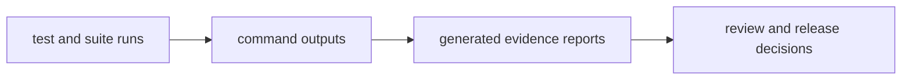

# Evidence Collection

Evidence collection transforms test and contract outcomes into reviewable records
for release and governance decisions.

## Visual Summary

## Evidence Sources

- test outputs from workspace and program suites
- report generators in `bijux-dev` command binaries
- contract files and schema checks under `contracts/`
- docs-check outputs for handbook publish integrity

## Collection Rules

- evidence must reference the exact commit under review
- generated reports are auditable artifacts, not policy replacements
- missing evidence is treated as unresolved risk, not assumed success

## Code Anchors

- `crates/bijux-dev/src/commands/evidence_registry.rs`
- `crates/bijux-dev/src/commands/evidence_control_plane.rs`
- `crates/bijux-dev/src/report/`

## Next Reads

- [Diagnostics and Reporting](diagnostics-and-reporting.md)
- [Change Control](../governance/change-control.md)
- [Risk and Exceptions](../../bijux-core/governance/risk-and-exceptions.md)
