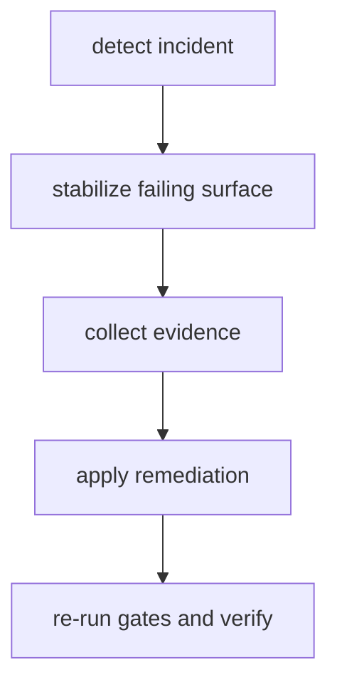

# Incident Response

Incident response for `bijux-core` must preserve evidence, isolate impact,
and restore reliable gates quickly.

## Visual Summary

## Incident Classes

- release pipeline failures
- cross-program compatibility regressions
- docs publishing regressions
- ownership or layout contract breakages

## Response Rules

- capture failing outputs before cleanup actions
- assign owner and impact scope explicitly
- track temporary exceptions with expiration
- publish post-incident notes for recurring failure classes

## Code Anchors

- `crates/bijux-dev/src/commands/ops.rs`
- `crates/bijux-dev/src/suites/release.rs`
- `crates/bijux-dev/src/suites/docs.rs`

## Next Reads

- [Release Operations](release-operations.md)
- [Risk and Exceptions](../../bijux-core/governance/risk-and-exceptions.md)
- [Security and Secrets](../governance/security-and-secrets.md)
