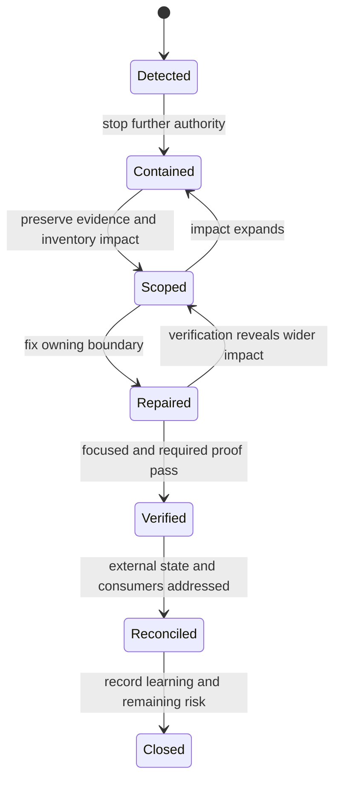

# Incident Response

Use this runbook when repository automation, publication, generated evidence,
or a supported artifact can no longer be trusted. The objective is not merely
to make a failing command green. It is to stop further impact, preserve the
facts needed to determine scope, repair the owning boundary, and prove that
the recovered path is trustworthy.

## Incident Classes

| Class | Examples | Immediate owner |
| --- | --- | --- |
| security or credential | exposed token, untrusted code with write authority, secret in an artifact | security responder and owner of the affected authority |
| publication | partial registry release, wrong artifact, tag or digest mismatch | release owner |
| verification integrity | skipped required checks, false success, incomplete aggregate report, corrupted evidence | owning gate or suite maintainer |
| product compatibility | CLI and DAG surfaces disagree, supported artifact regresses | owning product package |
| documentation publication | broken public routes, stale generated reference, wrong deployed revision | documentation publishing owner |
| repository boundary | dependency direction, package ownership, or managed-standard integrity breaks | repository governance owner |

If more than one class applies, use the stricter handling. A credential
exposure during publication is a security incident, not only a release
failure.

## Response Priority

| Condition | Priority | First irreversible risk |
| --- | --- | --- |
| credential, signing identity, or untrusted-code exposure | immediate containment | continued unauthorized access or mutation |
| wrong or conflicting artifact reached a registry or deployment | immediate containment and external inventory | additional consumers receive the artifact |
| release stopped after any external publication | publication incident | blind retry creates conflicting external state |
| required verification falsely passed or omitted selected work | block merge and release | unproved source advances |
| checked-in or deployed evidence is corrupt or bound to the wrong source | quarantine the evidence | downstream decisions cite invalid proof |
| documentation route or generated reference is broken without security impact | stop affected publication and repair owner | readers act on missing or stale guidance |

Priority follows authority and propagation, not how easy the failure is to
reproduce. A small credential leak outranks a large deterministic test failure.

## Response State

States must not be collapsed. A repair is not recovery while external state is
unknown, and a successful rerun is not closure while affected consumers or
credentials remain unresolved.

## Contain Before Repair

1. Stop the affected workflow, deployment, or publication path without
   deleting its logs or artifacts.
2. Prevent another automatic retry when it could publish, overwrite, rotate,
   or invalidate evidence.
3. For suspected credential exposure, revoke or rotate the credential at its
   issuing authority before restoring automation.
4. Preserve the source revision, command or workflow identity, timestamps,
   environment facts, final status, logs, and artifact digests.
5. Name the incident class, affected surfaces, responder, and publication or
   recovery owner.

Containment can intentionally leave a service or publication path unavailable.
Restoring automation before its authority and evidence are understood creates
a second incident.

## Preserve An Evidence Snapshot

Keep the original evidence read-only. A useful snapshot identifies:

- the exact commit, tag, dirty-worktree state, and dependency lock state;
- the initiating actor, event, command, workflow run, and selected checks;
- stdout, stderr, terminal or aggregate status, and any timeout or
  cancellation;
- generated file paths, checksums, signatures, registry identities, and
  deployment revision;
- secrets or personal data that require restricted storage and private
  handling;
- the first known affected result and the last result known to be trustworthy.

Local diagnostic output belongs under `artifacts/`. Do not commit confidential
incident evidence. Use the private channel in the root
[`SECURITY.md`](../../../SECURITY.md) when exploit details, credentials,
private data, or an unpatched vulnerability are involved.

## Establish Scope

Do not begin with a broad rerun. First compare the failed result with its
declared contract and answer:

| Question | Required evidence |
| --- | --- |
| what operation failed? | producer, arguments, selection, and final status |
| what authority could it exercise? | workflow permissions, credentials, registry, filesystem, or deployment scope |
| what output escaped the repository? | package versions, image digests, release assets, tags, or deployed docs revision |
| is the evidence itself reliable? | complete logs, aggregate status, checksum or signature, and source identity |
| what is the smallest owning boundary? | product package, maintainer suite, make adapter, workflow, or upstream shared standard |
| who or what consumed the result? | users, registries, downstream automation, or release processes |

A local success can distinguish an environment failure from a source defect,
but it does not invalidate the original incident. Preserve the original and
reproduction evidence under the collection rules before changing state.

## Reconcile Partial Publication

For a release, package, image, or documentation incident, inventory every
external surface before retrying:

1. Compare the expected package versions, release assets, image digests, tag,
   and documentation revision with what is publicly available.
2. Mark each expected output as absent, correct, conflicting, or unverifiable.
3. Determine whether the external service permits replacement, requires a new
   version, or needs removal or deprecation.
4. Record which consumers could have observed each conflicting output.
5. Resume only the unpublished or safely repeatable operations. Never rerun a
   complete publication sequence merely because one step failed.

The [Release Operations](release-operations.md) page defines the intended
publication sequence and proof.

## Repair The Owner

Fix the boundary that allowed the incident:

- product semantics in the owning product crate;
- suite selection, aggregation, and evidence in `bijux-dev`;
- orchestration in make or the owning workflow;
- organization-wide generated policy in `bijux-std`, followed by a governed
  downstream refresh.

Do not suppress the failing check, narrow required selection, erase the
original evidence, or add an undocumented retry. A temporary operational
exception must have an owner, explicit scope, expiry condition, and a path back
to the enforced rule.

## Recovery Criteria

Recovery is complete only when all applicable statements are true:

- the original impact is contained and external state is reconciled;
- the owning defect has a regression test or equivalent contract control;
- the focused reproduction fails before the repair and passes after it;
- the required gate runs from the repaired source revision and records final
  aggregate status;
- generated evidence identifies its producer, source, selection, and
  integrity;
- publication credentials and permissions are restored only after review;
- affected users or maintainers receive the appropriate operational or
  security communication.

A process ID, a new artifact path, or one successful component is not recovery
evidence.

## Recovery Proof

| Proof | Required linkage |
| --- | --- |
| containment | authority disabled or constrained, with timestamp and owner |
| scope | first affected and last known-good identity, plus consumer and external-state inventory |
| repair | owning change linked to the violated contract or invariant |
| regression control | test, validator, policy, or monitor that detects the same failure mode |
| focused verification | exact reproduction against the repaired source |
| complete verification | required suite selection and final aggregate status |
| external reconciliation | registry, deployment, credential, or consumer outcome for every affected surface |
| closure | incident record, communication decision, residual risk, and accountable owner |

## Close And Learn

The incident record should state impact, timeline, root cause, affected
authorities, external state, repair, verification, and remaining risk. Add a
durable contract or runbook correction when the same failure mode could recur;
do not encode the incident chronology in source names or permanent module
structure.

## Implementation Anchors

- `crates/bijux-dev/src/commands/ops.rs`
- `crates/bijux-dev/src/suites/release.rs`
- `crates/bijux-dev/src/suites/docs.rs`

## Related Operations

- [Release Operations](release-operations.md)
- [Evidence Collection](evidence-collection.md)
- [Repository Trust Evidence](../../bijux-core/governance/trust-evidence.md)
- [CI and Automation](ci-and-automation.md)
