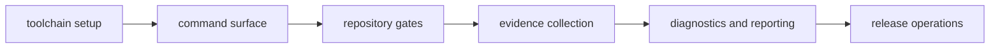

# Dev Operations

This section documents day-to-day maintainer operations for running governance
commands, collecting evidence, and coordinating release readiness.

## Visual Summary

## Pages In This Section

- [Toolchain Setup](toolchain-setup.md)
- [Command Surface](command-surface.md)
- [Repository Gates](repository-gates.md)
- [Evidence Collection](evidence-collection.md)
- [Diagnostics and Reporting](diagnostics-and-reporting.md)
- [Docs Operations](docs-operations.md)
- [CI and Automation](ci-and-automation.md)
- [Incident Response](incident-response.md)
- [Release Operations](release-operations.md)
