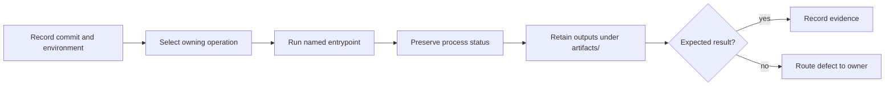

# Dev Operations

This section documents day-to-day maintainer operations for running governance
commands, collecting evidence, and coordinating release readiness.

These pages explain the operational side of the maintainer package. For the
root command surface itself, use [makes](../makes/index.md). For hosted
automation entrypoints, use [gh-workflows](../gh-workflows/index.md).

The command, console output, report, and exit status describe one run. Keeping
only the most convenient part weakens the evidence and can conceal partial
failure.

## Choose The Operation

| Situation | Start here | Result |
| --- | --- | --- |
| the workstation or toolchain is not trusted yet | [Toolchain Setup](toolchain-setup.md) | verified tools and repository prerequisites |
| the owning command family is unclear | [Command Surface](command-surface.md) | correct maintainer binary and command boundary |
| a change needs local or frozen validation | [Repository Gates](repository-gates.md) | exact gate, commit, result, and artifact location |
| a check passed but reviewable proof is missing | [Evidence Collection](evidence-collection.md) | governed evidence with producer and consumer |
| a gate failed and the failure domain is unclear | [Diagnostics And Reporting](diagnostics-and-reporting.md) | classified defect and owning surface |
| documentation changed | [Documentation Operations](docs-operations.md) | synchronized sources and strict site proof |
| local and hosted results disagree | [CI And Automation](ci-and-automation.md) | environment or workflow attribution |
| release validation failed | [Release Validation Suite](release-validation-suite.md) | failed release claim and evidence owner |
| release artifacts are ready to publish | [Release Operations](release-operations.md) | verified publication sequence and retained proof |
| automation or release state is degraded | [Incident Response](incident-response.md) | contained impact, evidence, and recovery record |

## Operational Completion

An operation is complete when the following facts can be reconstructed:

| Fact | Required evidence |
| --- | --- |
| source under test | full commit identity and clean/dirty state |
| execution context | command, relevant overrides, toolchain, and platform |
| result | unmodified final exit status |
| detailed behavior | complete console log or structured report |
| produced state | governed artifact paths and checksums where applicable |
| ownership | package, Make adapter, shared standard, or hosted workflow |

For frozen validation, the pinned worktree is an execution input rather than a
scratch directory. A dirty pinned source invalidates reproducibility and must
fail before the suite runs. For long-running background validation, publish the
PID, console path, status path, and source commit immediately; completion
evidence still requires the final status and summary.

## Failure Discipline

- Do not pipe away or overwrite the command's exit status.
- Do not stop a complete-suite lane after the first failing test when the lane
  promises aggregate evidence.
- Do not rerun publication until every registry is checked for partial success.
- Do not turn a missing report into an empty successful report.
- Do not diagnose a hosted permission failure by changing product behavior.
- Do not delete failed artifacts before the defect is classified.

Policy decisions belong in [Dev Governance](../governance/index.md). Local make
entrypoints belong in [makes](../makes/index.md), and hosted triggers belong in
[GitHub Workflows](../gh-workflows/index.md).
