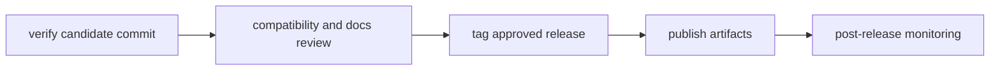

# Release Operations

This page explains how `bijux-core` moves from a verified commit to a released
artifact.

The release path is intentionally conservative. Each step exists to make sure
the tagged result still matches the behavior, compatibility notes, and docs the
repository is prepared to stand behind.

## Release Flow



## Release Workflow Rules

- only tag commits with green required gates
- include compatibility notes for CLI and DAG changes
- ensure docs navigation and links are valid before publishing
- verify post-release health and rollback readiness

## Current Publication Policy

- `v0.3.5` publishes `bijux-cli` to crates.io and `bijux-cli` to PyPI.
- `bijux-dag-*` crates remain internal and are intentionally not published in `v0.3.5`.
- DAG publication is deferred to `v0.4.0`, when CLI and DAG are released together.
- canonical repository for both programs is `https://github.com/bijux/bijux-core`.

## Preflight Checklist

- required tests and maintainer verification commands are green
- compatibility notes are prepared for changed public behavior
- documentation tree and MkDocs navigation are synchronized
- release owner and rollback owner are explicitly assigned

## Postflight Checklist

- published artifacts match tagged commit identity
- docs site builds and serves expected handbook routes
- no new unresolved failures in release-monitoring workflows

## Standard Commands

```bash
cargo run -q -p bijux-dev --bin bijux-dev-cli -- quickcheck --format json --no-pretty
cargo run -q -p bijux-dev --bin bijux-dev-cli -- release
make docs-check
```

## Reading Rule

Use this page when the repository is close to a release boundary and the next
question is sequence and proof, not implementation. Move to Contract
Governance or Testing and Validation when the release question is still blocked
by unresolved behavior.

## Code Anchors

- `crates/bijux-dev/src/commands/cli_release_command.rs`
- `crates/bijux-dev/src/suites/release.rs`
- `.github/workflows/`

## Next Reads

- [Core Release and Versioning](../../bijux-core/governance/release-and-versioning.md)
- [Contract Governance](../governance/contract-governance.md)
- [Known Limitations](../governance/known-limitations.md)
