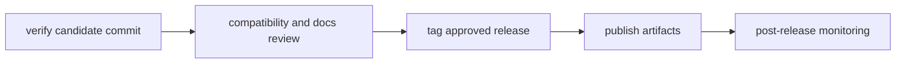

# Release Operations

This page explains how `bijux-core` moves from a verified commit to a released
artifact.

The release path is intentionally conservative. Each step exists to make sure
the tagged result still matches the behavior, compatibility notes, and docs the
repository is prepared to stand behind.

## Release Flow



## Release Workflow Rules

- only tag commits with green required gates
- keep release lanes on Rust `1.86.0`, matching `Cargo.toml`, `rust-toolchain.toml`, and `ci.yml`
- include compatibility notes for CLI and DAG changes
- ensure docs navigation and links are valid before publishing
- verify post-release health and rollback readiness

## Current Publication Policy

Canonical package status and publish order are defined by
`contracts/foundation/workspace_package_boundary.v1.json` and
[Package Boundary](../../bijux-core/foundation/package-boundary.md).

- `v0.4.0` publishes `bijux-cli` to crates.io and PyPI.
- `v0.4.0` publishes the DAG Rust crates to crates.io in dependency order: `bijux-dag-core`, `bijux-dag-artifacts`, `bijux-dag-runtime`, `bijux-dag-app`, and `bijux-dag-cli`.
- GitHub Releases and GHCR publish two stamped release families: the `bijux-cli` distribution bundle and the `bijux-dag` binary tarball.
- `bijux-dag-testkit`, `bijux-dev`, and `bijux-cli-python` remain repository-internal support crates and are not published to crates.io.
- The canonical repository for both products is `https://github.com/bijux/bijux-core`.

## Preflight Checklist

- required release-lane tests and maintainer verification commands are green
- `make release-validate-rs` is green before any release recommendation
- `make test-release-rs` is green before any release recommendation
- `make test-all-rs` is green whenever DAG experimental or internal ignored coverage changed or ignored-test governance changed
- compatibility notes are prepared for changed public behavior
- documentation tree and MkDocs navigation are synchronized
- release owner and rollback owner are explicitly assigned

## Postflight Checklist

- published artifacts match tagged commit identity
- docs site builds and serves expected handbook routes
- no new unresolved failures in release-monitoring workflows

## Standard Commands

```bash
make release-validate-rs
make test-release-rs
make test-all-rs
cargo run -q -p bijux-dev --bin bijux-dev-cli -- quickcheck --format json --no-pretty
cargo run -q -p bijux-dev --bin bijux-dev-cli -- release verify
make docs-check
```

## Release Validation Suite

The release validation suite runs against a clean tree prepared from committed
`HEAD`, not the live worktree. That keeps unrelated local edits out of release
evidence and makes local verification match the publish surface checked by CI.

### Validation Commands

- `make release-validate-rs`
- `cargo run -q -p bijux-dev --bin bijux-dev-cli -- release verify`

### Validation Coverage

- `cargo fmt --all -- --check`
- `cargo clippy --workspace --all-targets --all-features --locked -- -D warnings`
- `cargo test --workspace --all-targets --all-features --locked`
- `cargo doc --workspace --all-features --no-deps`
- `cargo package --list` for the public DAG crate family
- `cargo publish --dry-run --locked` for the public DAG crate family
- `cargo test -p bijux-dag-cli --test smoke_pipeline --locked -- --nocapture`

### Validation Outputs

- clean release tree: `artifacts/rust/release-validation/<run-id>/workspace/`
- shared target dir: `artifacts/rust/release-validation/<run-id>/target/`
- command logs: `artifacts/rust/release-validation/<run-id>/`
- release readiness report: `artifacts/release/readiness_report.json`
- compatibility matrix: `artifacts/release/compatibility_matrix.json`

## Reading Rule

Use this page when the repository is close to a release boundary and the next
question is sequence and proof, not implementation. Move to Contract
Governance or Testing and Validation when the release question is still blocked
by unresolved behavior.

## Code Anchors

- `crates/bijux-dev/src/commands/cli_release_command.rs`
- `crates/bijux-dev/src/suites/release.rs`
- `.github/workflows/`

## Next Reads

- [Core Release and Versioning](../../bijux-core/governance/release-and-versioning.md)
- [Contract Governance](../governance/contract-governance.md)
- [Known Limitations](../governance/known-limitations.md)
