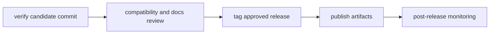

# Release Operations

Release operations coordinate verification, compatibility review, tagging, and
publishing across programs.

## Visual Summary



## Release Workflow Rules

- only tag commits with green required gates
- include compatibility notes for CLI and DAG changes
- ensure docs navigation and links are valid before publishing
- verify post-release health and rollback readiness

## Standard Commands

```bash
cargo run -q -p bijux-dev --bin bijux-dev-cli -- verify
cargo run -q -p bijux-dev --bin bijux-dev-cli -- release
make docs-check
```

## Code Anchors

- `crates/bijux-dev/src/commands/cli_release_command.rs`
- `crates/bijux-dev/src/suites/release.rs`
- `.github/workflows/`

## Next Reads

- [Core Release and Versioning](../../bijux-core/governance/release-and-versioning.md)
- [Contract Governance](../governance/contract-governance.md)
- [Known Limitations](../governance/known-limitations.md)
