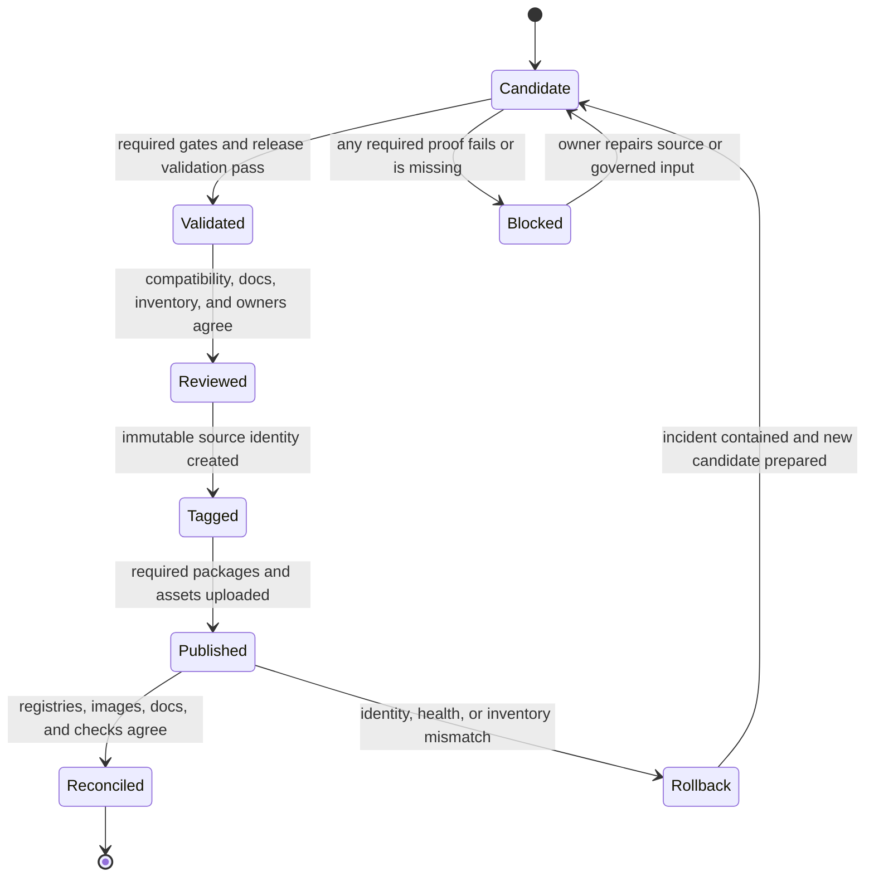

# Release Operations

Use this page when the repository is close to a release boundary and the next
question is sequence, ownership, and proof rather than implementation.

The release path is intentionally conservative. A tag is credible only when
the source requirements, generated release policy, tested behavior, package
inventory, compatibility notes, and published artifacts all identify the same
candidate.

Visible maintainer command ownership remains governed by
`contracts/foundation/maintainer_command_surface.v1.json`.

## Release Workflow Rules

- only tag commits with green required gates
- use the workspace `rust-version` as the source-owned compiler requirement
- require synchronized CI, release, and package-policy inputs to match the
  workspace before recommending a tag
- include compatibility notes for CLI and DAG changes
- ensure docs navigation and links are valid before publishing
- verify post-release health and rollback readiness

Generated workflow and release-policy files are managed by `bijux-std`. A
downstream mismatch is a release blocker to resolve upstream and refresh
through the governed standards process. Do not hand-edit synchronized files or
describe a failing alignment contract as release ready.

## Current Publication Policy

Canonical package status and publish order are defined by
`contracts/foundation/workspace_package_boundary.v1.json` and
[Package Boundary](../../bijux-core/foundation/package-boundary.md).

- `v0.4.0` publishes `bijux-cli` to crates.io and PyPI.
- `v0.4.0` publishes the DAG Rust crates to crates.io in dependency order: `bijux-dag-core`, `bijux-dag-artifacts`, `bijux-dag-runtime`, `bijux-dag-app`, and `bijux-dag-cli`.
- GitHub Releases and GHCR publish two stamped release families: the `bijux-cli` distribution bundle and the `bijux-dag` binary tarball.
- `bijux-dag-testkit`, `bijux-dev`, and `bijux-cli-python` remain repository-internal support crates and are not published to crates.io.
- The canonical repository for both products is `https://github.com/bijux/bijux-core`.

## Sequence That Must Hold

| Step | What it should prove |
| --- | --- |
| release validation | the candidate commit is publishable from a clean release tree |
| generated-policy alignment | toolchain, package allowlist, and build matrices cover the same release boundary as the repository |
| compatibility and docs review | public readers can understand what changed and whether compatibility moved |
| tag and publish | published artifacts point back to the reviewed commit identity |
| post-release monitoring | the public result still behaves like the reviewed release lane predicted |



There is no valid transition from `Candidate` directly to `Tagged` or
`Published`. An upload that bypasses validation and review is an incident to
reconcile or roll back, not a release success.

## Preflight Checklist

- required release-lane tests and maintainer verification commands are green
- release ownership contracts confirm the synchronized Rust toolchain,
  publishable package allowlist, and CLI/DAG build matrices match repository
  policy
- `make release-validate-rs` is green before any release recommendation
- `make test-release-rs` is green before any release recommendation
- `make test-all-rs` is green whenever DAG experimental or internal ignored coverage changed or ignored-test governance changed
- `bijux-dev-cli maintenance ignored-dag-tests` reports `integrity_status: ok`
  whenever ignored-test governance, quarantined portfolios, or source-level DAG
  test helpers changed
- compatibility notes are prepared for changed public behavior
- documentation tree and MkDocs navigation are synchronized
- the candidate worktree is clean and every cited result identifies its full
  source commit
- release owner and rollback owner are explicitly assigned

## Postflight Checklist

- published artifacts match tagged commit identity
- package registries, GitHub release assets, images, and deployed docs are
  reconciled against the expected publication inventory
- docs site builds and serves expected handbook routes
- no new unresolved failures in release-monitoring workflows

Postflight reconciliation must compare immutable identities, not names alone:
the tag target, package checksums, image digest, release assets, and deployed
documentation revision must all resolve to the reviewed candidate.

## Standard Commands

```bash
make release-validate-rs
make test-release-rs
make test-all-rs
cargo run -q -p bijux-dev --bin bijux-dev-cli -- maintenance ignored-dag-tests
cargo run -q -p bijux-dev --bin bijux-dev-cli -- docs write-dag-cli-reference
cargo run -q -p bijux-dev --bin bijux-dev-cli -- quickcheck --format json --no-pretty
cargo run -q -p bijux-dev --bin bijux-dev-cli -- release verify
make docs-check
```

## Release Validation Suite

Use [Release Validation Suite](release-validation-suite.md) for the canonical
release-candidate gate. That page owns the exact command inventory, execution
model, artifact outputs, and failure ownership for `make release-validate-rs`,
`make gh-release-validate`, and `cargo run -q -p bijux-dev --bin bijux-dev-cli -- release verify`.

At the release-operations level, the important rule is sequence: release
validation happens before tag creation and before any publish command is trusted
as release evidence.

## Broken Sequence

If a tag, artifact, or release note gets ahead of release validation and
compatibility review, the repository has already broken sequence even if the
publish technically succeeds. The same is true when generated release policy
does not match workspace ownership: a successful individual upload is not
proof that the intended release family was validated or published.

## Code Anchors

- `crates/bijux-dev/src/commands/cli_release_command.rs`
- `crates/bijux-dev/src/suites/release.rs`
- `crates/bijux-cli/tests/architecture/ownership/release_contracts.rs`
- `contracts/foundation/workspace_package_boundary.v1.json`
- `.github/standards/repo-config.manifest.json`
- `.github/workflows/`

## Related Guidance

- [Release Validation Suite](release-validation-suite.md)
- [Core Release and Versioning](../../bijux-core/operations/release-and-versioning.md)
- [Contract Governance](../governance/contract-governance.md)
- [Known Limitations](../governance/known-limitations.md)
