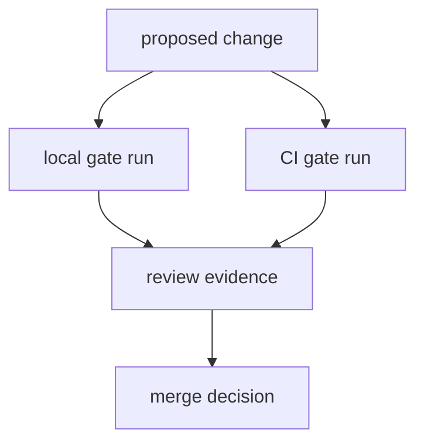

# Repository Gates

This page explains the gate structure that protects `bijux-core` before merge.

The gates are shared on purpose. They let reviewers see the same proof locally,
in CI, and in release preparation instead of depending on one narrow signal.

## Gate Flow



## Gate Layers

- workspace build and test gates
- program-level contract gates for CLI and DAG
- docs structure, link, and build gates
- maintainer suite gates for ownership and policy contracts

## Canonical Commands

```bash
make test
make dag-test
make docs-check
cargo run -q -p bijux-dev --bin bijux-dev-cli -- quickcheck --format json --no-pretty
```

## Gate Failure Triage

When a gate fails, classify first before retrying:

1. `layout/docs` failure
2. `contract/schema` failure
3. `runtime/test` failure
4. `automation/workflow` failure

Classification controls which maintainer commands and handbook pages to use
next.

## Reading Rule

Use this page when a failure is real but the right gate family is still unclear.
Move to the more specific operations pages once the failure is clearly about
docs, automation, contracts, or release work.

## Code Anchors

- `makes/rust.mk`
- `makes/dag.mk`
- `makes/docs.mk`
- `crates/bijux-dev/src/suites/`

## Next Reads

- [Evidence Collection](evidence-collection.md)
- [Quality Policy](../governance/quality-policy.md)
- [Core Testing and Validation](../../bijux-core/governance/testing-and-validation.md)
