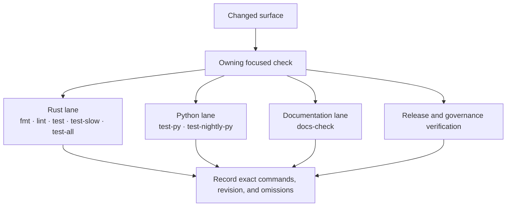
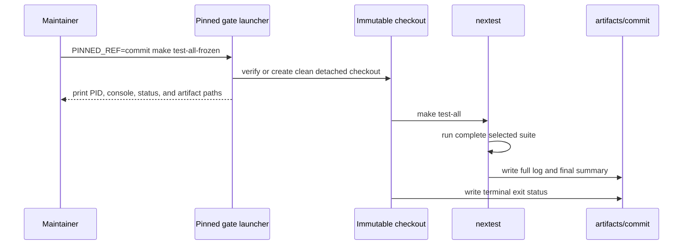

# Repository Gates

Use this page when a change is ready for scrutiny and you need to know which
gate families are supposed to prove it safe to merge.

Repository gates matter because `bijux-core` does not treat CI as a ceremonial
green badge. The same evidence should support local review, continuous
integration, and release readiness.

## Choose The Smallest Honest Lane

| Gate | Scope | Cost and use |
| --- | --- | --- |
| `make fmt` | Rust formatting | fast pre-commit syntax and style proof |
| `make lint` | configured Rust lint policy | routine review gate after implementation changes |
| `make test` | required Rust release lane plus Python tests | normal repository test gate; governed slow Rust tests are excluded |
| `make test-slow` | governed slow Rust roster | deliberate expensive behavior, performance, and stress coverage |
| `make test-all` | complete Rust suite including ignored tests | broad local proof; not the default edit loop |
| `PINNED_REF=<commit> make test-all-frozen` | `test-all` from an immutable checkout | long-running evidence tied to an exact commit |
| `make docs-check` | source contracts, strict MkDocs build, publication budget, and navigation | every reader-facing documentation or navigation change |

`make test-all` is a complete Rust lane, not a claim that Python, docs, release,
or every governance command also ran. Select those gates separately when the
change crosses their ownership boundary.



Follow only the branches owned by the change, but follow every applicable
branch. A broad Rust run cannot compensate for omitted Python, documentation,
or release validation.

## Focused Tests First

For one failed Rust test, rerun its owning binary and test name before using a
root lane:

```bash
cargo nextest run -p bijux-dev \
  --test docs_source_reference_contracts \
  -E 'test(markdown_links_and_anchors_resolve)'
```

Focused success proves the repaired behavior. It does not replace broader
contract or repository validation when the underlying change affects those
surfaces.

## How To Read A Failure

When a gate fails, classify it before retrying:

1. formatting or static policy
2. documentation source, link, build, or navigation
3. contract, schema, generated reference, or retained evidence
4. runtime behavior
5. automation, environment, or toolchain

Classification controls which maintainer commands and handbook pages to use
next.

For frozen suites, use the printed console log, status file, and primary
nextest report under `artifacts/<commit>/`. Preserve the final nextest summary:
passed, failed, slow, skipped, and leaky counts are part of the evidence even
when the command exits unsuccessfully.



The launch command returning successfully proves only that the background
process started. Completion is established by the status file together with
the terminal nextest summary. Individual test failures do not suppress the
remaining selected tests or the summary.

## What A Green Gate Should Mean

| Signal | What it should prove |
| --- | --- |
| local gate success | the change is reproducible on a maintainer workstation |
| CI gate success | the change survives repository automation and baseline environments |
| docs gate success | published guidance still matches the code and file layout |
| contract gate success | public promises still align with behavior and schemas |

## Reporting Rule

Report the exact command, commit, result, and any intentionally omitted lane.
Do not describe a focused test as a full gate, a complete Rust lane as a
repository-wide test, or a background launch as a successful result.

## Code Anchors

- `makes/rust.mk`
- `makes/dag.mk`
- `makes/docs.mk`
- `crates/bijux-dev/src/suites/`

## Continue Reading

- [Evidence Collection](evidence-collection.md)
- [Quality Policy](../governance/quality-policy.md)
- [Core Testing and Validation](../../bijux-core/operations/testing-and-validation.md)
