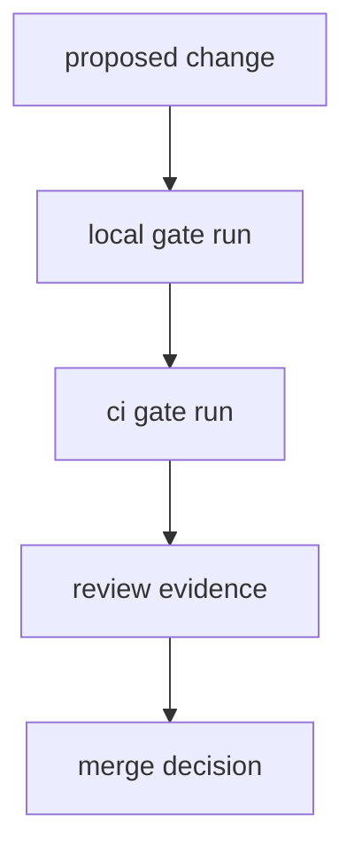

# Repository Gates

Repository gates ensure CLI, DAG, docs, and maintainer changes are verified with
shared entrypoints before merge.

## Visual Summary



## Gate Layers

- workspace build and test gates
- program-level contract gates for CLI and DAG
- docs structure, link, and build gates
- maintainer suite gates for ownership and policy contracts

## Canonical Commands

```bash
make test
make dag-test
make docs-check
cargo run -q -p bijux-dev --bin bijux-dev-cli -- verify
```

## Code Anchors

- `makes/rust.mk`
- `makes/dag.mk`
- `makes/docs.mk`
- `crates/bijux-dev/src/suites/`

## Next Reads

- [Evidence Collection](evidence-collection.md)
- [Quality Policy](../governance/quality-policy.md)
- [Core Testing and Validation](../../bijux-core/governance/testing-and-validation.md)
