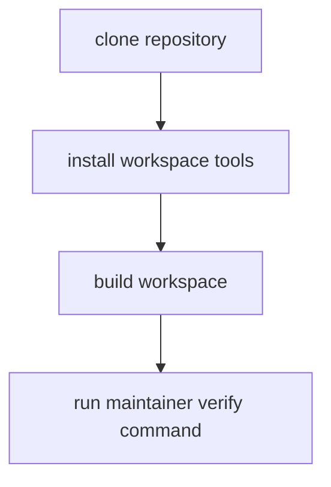

# Toolchain Setup

Maintainer operations require a reproducible local setup that mirrors CI gates
and avoids hidden host-specific behavior.

## Visual Summary



## Setup Requirements

- Rust toolchain defined by repository toolchain files
- Python environment and MkDocs dependencies available for docs gates
- `make` targets available for shared workflows

## Baseline Setup Commands

```bash
make install
cargo build --workspace
cargo run -q -p bijux-dev --bin bijux-dev-cli -- verify
make docs-check
```

## Code Anchors

- `Makefile`
- `makes/root.mk`
- `crates/bijux-dev/src/tooling/`

## Next Reads

- [Repository Gates](repository-gates.md)
- [CI and Automation](ci-and-automation.md)
- [Test Policy](../governance/test-policy.md)
