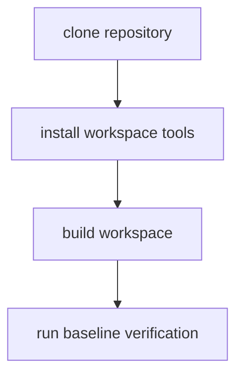

# Toolchain Setup

This page explains the minimum local setup needed to work on `bijux-core`
without drifting away from CI.

The goal is not to install everything possible. It is to make sure the local
environment can produce the same signals the repository depends on for review.

## Setup Flow



## Setup Requirements

- Rust `1.86.0`, pinned by `rust-toolchain.toml` and reused by CI and release automation
- Python environment and MkDocs dependencies available for docs gates
- `make` targets available for shared workflows

## Baseline Setup Commands

```bash
make install
cargo build --workspace
cargo run -q -p bijux-dev --bin bijux-dev-cli -- quickcheck --format json --no-pretty
make docs-check
```

## Reading Rule

Use this page when the local machine is not yet trustworthy enough for review
work. Move to Repository Gates or CI and Automation once the environment itself
is no longer the problem.

## Code Anchors

- `Makefile`
- `makes/root.mk`
- `crates/bijux-dev/src/tooling/`

## Next Reads

- [Repository Gates](repository-gates.md)
- [CI and Automation](ci-and-automation.md)
- [Test Policy](../governance/test-policy.md)
