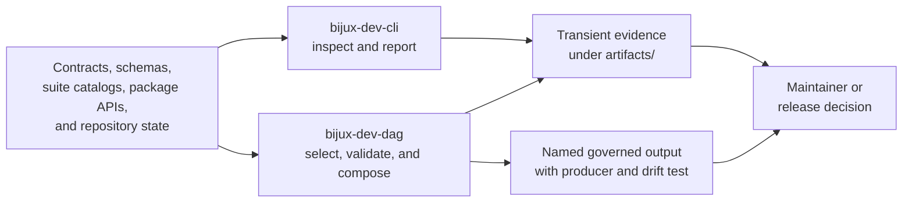

# bijux-dev

`bijux-dev` is the private maintainer package for this repository. It converts
repository policy, public product contracts, retained evidence, and release
requirements into inspectable commands and tests. It is not an end-user
product and is not published as an installable package.

## Control-Plane Boundary



The package observes and enforces declared product contracts. It does not
become the authority for the product behavior it inspects.

## Binary Authorities

| Binary | Authoritative responsibilities | Typical result |
| --- | --- | --- |
| `bijux-dev-cli` | repository status, runtime and package diagnostics, documentation publishing, maintenance audits, and cross-surface parity views | text, JSON, or YAML observations |
| `bijux-dev-dag` | governed suite discovery, policy and contract execution, evidence verification, DAG diagnostics, and release-proof composition | validation envelopes, governed evidence, and aggregate process status |

These binaries are not aliases. `bijux-dev-cli` presents repository and
product observations. `bijux-dev-dag` composes enforceable governance. The
visible `bijux-dev-dag` root command surface is governed by
`contracts/foundation/maintainer_command_surface.v1.json`.

Use `bijux-dev-cli` when the desired result is a repository observation. Use
`bijux-dev-dag` when selection policy, required status, evidence verification,
or release-proof composition is part of the outcome.

## Package Boundary

The package may depend on product crates and read their public contracts to
detect repository-wide drift. Product crates must not depend on `bijux-dev`.

`bijux-dev` owns:

- repository layout, dependency, documentation, and policy checks;
- suite discovery, selection, explanation, and aggregate status;
- generated governance and release evidence with explicit source identity;
- maintainer reports that inspect product facts without redefining them.

It does not own `bijux` routing or plugin behavior, DAG execution semantics,
Python bridge behavior, or organization-wide workflow policy synchronized
from `bijux-std`.

Dependency direction is deliberate: maintainer code may inspect public product
contracts, but product crates must never require `bijux-dev` to compile or run.
`bijux-dag-testkit` is development-only support.

## Source Ownership

| Path | Responsibility |
| --- | --- |
| `crates/bijux-dev/src/maintainer/` | repository and product diagnostic report composition |
| `crates/bijux-dev/src/commands/` | `bijux-dev-dag` command behavior and governed command families |
| `crates/bijux-dev/src/suites/` | reusable suite definitions, metadata, and selection |
| `crates/bijux-dev/src/repo/` | repository inspection and repository-owned operations |
| `crates/bijux-dev/src/report/` | shared report and evidence presentation |
| `crates/bijux-dev/src/bin/bijux-dev-cli.rs` | diagnostic binary entrypoint |
| `crates/bijux-dev/src/main.rs` | governance binary entrypoint |
| `crates/bijux-dev/tests/` | architecture, command, policy, evidence, and release contracts |

Product behavior belongs in its product crate even when a maintainer contract
is the first test that detects the defect.

## Result Semantics

- Required validation exits non-zero when any selected required check fails.
- Advisory, slow, internal, and narrowed selections remain explicit in the
  result.
- Broad suites preserve component failures and produce an aggregate terminal
  status instead of turning partial execution into success.
- A process start, generated path, or individual report is not proof of
  success without final status and integrity review.
- Transient output belongs under `artifacts/`; checked-in generated output
  requires a named producer and a contract test.

## Command Effect Classes

| Effect | Contract |
| --- | --- |
| inspect | read repository or product state without changing source or governed output |
| validate | run checks and optionally write transient evidence under `artifacts/` |
| generate | write a named governed destination from explicit authorities and provide a drift check |
| mutate | change an explicit repository target through a dedicated command surface |

An inspection command must not quietly repair the state it reports. A
generator is not complete merely because it wrote a file: the result needs a
discoverable producer, inputs, deterministic or intentionally variable fields,
and a clean drift check.

## Suite And Aggregate Truth

Suite selection records what was and was not exercised:

- group and domain;
- selected suite identities;
- slow and internal inclusion;
- disabled or advisory entries; and
- narrowed filters.

Required failures remain nonzero. Non-fail-fast aggregates retain every
component result and still return an unsuccessful terminal status when any
required component failed. Unselected work is never reported as passing work,
and advisory evidence cannot substantiate a blocking release claim.

## Evidence Chain

A maintainer claim is reviewable when it answers:

1. Which command and source revision produced the result?
2. Which suites, contracts, packages, and exclusions were selected?
3. Which files contain the detailed observations?
4. Did all required components complete?
5. Does integrity verification still accept the retained evidence?

A generated path, started process, individual green report, or aggregate
summary without component status is not sufficient.

## Security And Operations

- Tool and subprocess boundaries stay explicit in command output and evidence.
- Credentials and secret values must not enter reports, command snapshots, or
  cacheable evidence.
- Repository mutation identifies its target before execution.
- Hosted wrappers preserve command status through logging and pipes.
- Synchronized standards are consumed, never rewritten locally.
- Release commands distinguish observation, validation, preparation, and
  publication authority.

## Verify The Boundary

```bash
cargo test -p bijux-dev --test foundation_maintainer_command_surface_contracts
cargo test -p bijux-dev --test docs_source_reference_contracts
```

These focused tests verify the package's documented surface and references.
They do not prove that the full Rust, Python, documentation, or release lanes
passed.

For a broader package change, add the focused suite for the owning command
family and run:

```bash
cargo test --locked -p bijux-dev
```

## Maintainer References

- [Package README](../../../crates/bijux-dev/README.md)
- [Package contracts](../../../crates/bijux-dev/docs/CONTRACTS.md)
- [Command Surface](../operations/command-surface.md)
- [Repository Gates](../operations/repository-gates.md)
- [Evidence Collection](../operations/evidence-collection.md)
- [Maintainer Handbook](../index.md)
