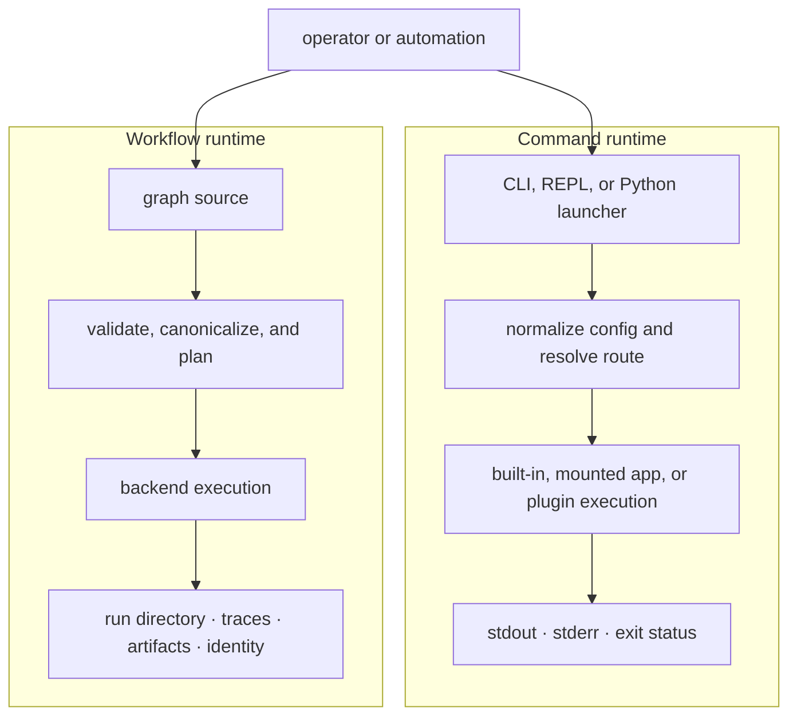
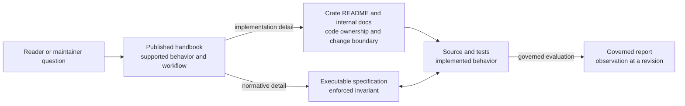

# Bijux Core

<!-- bijux-core-badges:generated:start -->

<!-- bijux-core-badges:generated:end -->

`bijux-core` is one repository with two public products:

- `bijux`, the command runtime for mounted apps, plugins, layered config,
  diagnostics, history, memory, and REPL workflows
- `bijux-dag`, the local-first DAG toolchain for validated graphs, repeatable
  execution, retained evidence, replay, comparison, and verification

Both products are built for operations that must remain explainable under
automation. `bijux` resolves a command to one owned runtime and preserves its
stream and exit semantics. `bijux-dag` turns a graph into a validated plan,
executes it through an explicit backend, and retains the evidence needed to
inspect, compare, or replay the result.

The same repository carries private verification surfaces that test release
claims against code, schemas, fixtures, and generated evidence. Those
maintainer tools validate the products; they are not hidden product APIs.

<strong>Start with the thing you want to run.</strong>
Use the CLI handbook for <code>bijux</code>. Use the DAG handbook for
<code>bijux-dag</code>. Use the repository handbook only when the question
crosses products, packages, or release rules.

  
<h3>Repository</h3>
Use the repository handbook when the question crosses package boundaries, release policy, or shared ownership rules.

  
<h3>CLI</h3>
Use the CLI handbook for command semantics, runtime behavior, plugin surfaces, REPL behavior, and Python distribution.

  
<h3>DAG</h3>
Use the DAG handbook for graph compilation, execution, replay, artifacts, and DAG command workflows.

  
<h3>Maintainer</h3>
Use the maintainer handbook for repository diagnostics, evidence collection, release verification, and policy enforcement.

<a class="md-button md-button--primary" href="bijux-core/">Open the repository handbook</a>
<a class="md-button" href="bijux-cli/">Open the CLI handbook</a>
<a class="md-button" href="bijux-dag/">Open the DAG handbook</a>
<a class="md-button" href="bijux-dev/">Open the maintainer handbook</a>

## What Ships Today

| Surface | Delivery | What you can rely on today |
| --- | --- | --- |
| `bijux` | Rust crate, PyPI distribution, release bundles | the visible `bijux --help` runtime, including apps, plugins, layered config, REPL, diagnostics, history, and memory |
| `bijux-dag` | Rust crates and release bundles | the visible `bijux-dag --help` local DAG surface for validate, plan, run, replay, inspect, compare, cache, and verify workflows |
| maintainer tooling | repository-internal only | contributor and release workflows, not end-user product API |

`bijux-dag` is intentionally honest about its current boundary. The stable lane
is local-first. Experimental, simulated, and maintainer-only routes exist in
the repository, but they are not presented here as the default product story.

## Two Execution Paths

The paths deliberately end differently. A CLI command returns process-facing
streams and status. A DAG run also leaves an integrity-bearing record because
replay, comparison, and post-run verification depend on durable evidence.

## Trust Properties

| Property | What the repository preserves | Where to verify it |
| --- | --- | --- |
| owned command routing | aliases normalize to canonical routes; delegated processes retain native streams and exit status | [CLI execution model](bijux-cli/architecture/execution-model.md) |
| explicit configuration | layered values can be traced to their source and secret-like fields are redacted by default | [CLI configuration guide](bijux-cli/interfaces/config-guide.md) |
| deterministic graph meaning | canonical graph and plan identities are separate from runtime and artifact identity | [DAG reproducibility model](bijux-dag/interfaces/reproducibility-model.md) |
| failure evidence | failed, skipped, blocked, cancelled, cached, and successful work remain distinguishable | [DAG failure recovery](bijux-dag/operations/failure-recovery.md) |
| honest isolation | enforced checks are separated from host, container, scheduler, and cluster assumptions | [Execution security](bijux-dag/operations/security-isolation-truth.md) |
| release traceability | publication boundaries and required evidence are machine-readable and contract-tested | [Repository release operations](bijux-core/operations/release-and-versioning.md) |

## Start In The Right Place

| If you want to... | Open this handbook |
| --- | --- |
| run `bijux`, mount apps, work with plugins, or debug runtime behavior | [CLI Handbook](bijux-cli/index.md) |
| author DAGs, run them locally, inspect artifacts, or replay a run | [DAG Handbook](bijux-dag/index.md) |
| understand what the repository publishes, how crates divide work, or how release boundaries are enforced | [Repository Handbook](bijux-core/index.md) |
| work on repository gates, release proof, or documentation and automation pipelines | [Maintainer Handbook](bijux-dev/index.md) |

## Practical Starting Points

- Read [Executable Examples](bijux-dag/interfaces/runnable-examples.md) when you
  want real DAG workflows with expected outputs, not just feature descriptions.
- Read [First-Run Tutorial](bijux-dag/operations/first-run-tutorial.md)
  when you want the shortest route from checkout to a real retained DAG run.
- Read [CLI Runtime Package](bijux-cli/packages/bijux-cli.md) when you already
  know the question belongs to `bijux` and need the crate boundary.
- Read [DAG Release Notes](bijux-dag/operations/v0-4-0-release-notes.md) when
  you want the current release claim in one place.

## Documentation Authority

The website contains curated reader guidance. Executable specifications and
generated evidence remain versioned in the repository but are not presented as
product handbook pages. Read the
[documentation system](bijux-core/foundation/documentation-system.md) for the
authority and maintenance rules.

Arrows do not make every document equally authoritative. Handbooks explain the
supported product, crate pages locate implementation ownership, specifications
state enforced behavior, and reports retain observations. A report cannot
override a contract, and an internal package detail cannot widen the public
product promise.

The [v0.4.0 Release Notes](bijux-dag/operations/v0-4-0-release-notes.md) define
the current DAG release. [Future Direction](bijux-dag/foundation/future-direction.md)
is non-binding direction; if it conflicts with the release boundary, the
narrower shipped claim wins.
