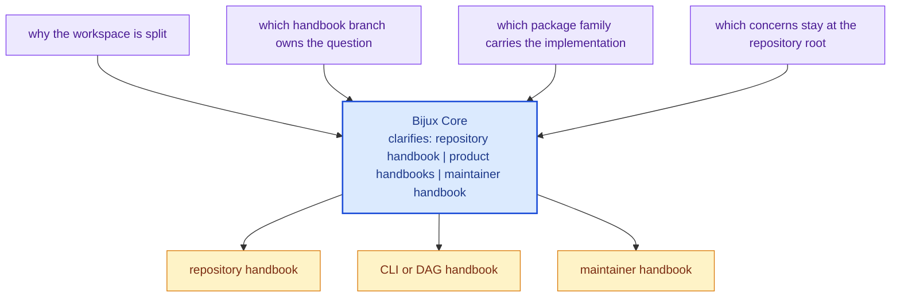

# Bijux Core

<!-- bijux-core-badges:generated:start -->

  

 
<!-- bijux-core-badges:generated:end -->

`bijux-core` is a deliberately split workspace for command runtime,
deterministic DAG execution, and repository control-plane work. The split is
the design, not a packaging afterthought. Readers should be able to see where
authority changes hands before they start reading source files or workflow
logs.

Start here when you need repository-level orientation. The job of this page is
to show which handbook branch owns the current question, which package family
likely carries the implementation, and which repository-only surfaces sit above
the product handbooks.

<strong>Start with ownership, not just the crate list.</strong>
Repository docs explain cross-workspace policy. CLI docs own the <code>bijux</code>
command product and Python bridge. DAG docs own graph truth, runtime policy,
artifacts, and DAG command orchestration. Maintainer docs own release proof,
repository gates, and governance tooling.

  
<h3>Repository</h3>
Use the repository handbook when the question crosses package boundaries, release policy, or shared ownership rules.

  
<h3>CLI</h3>
Use the CLI handbook for command semantics, runtime behavior, plugin surfaces, REPL behavior, and Python distribution.

  
<h3>DAG</h3>
Use the DAG handbook for graph compilation, execution, replay, artifacts, and DAG command workflows.

  
<h3>Maintainer</h3>
Use the maintainer handbook for repository diagnostics, evidence collection, release verification, and policy enforcement.

<a class="md-button md-button--primary" href="bijux-core/">Open the repository handbook</a>
<a class="md-button" href="bijux-cli/">Open the CLI handbook</a>
<a class="md-button" href="bijux-dag/">Open the DAG handbook</a>
<a class="md-button" href="bijux-dev/">Open the maintainer handbook</a>

## Visual Summary

## Start Here

- open [Repository Handbook](bijux-core/index.md) when the issue spans CLI,
  DAG, and maintainer ownership or touches release policy
- open [CLI Handbook](bijux-cli/index.md) for the `bijux` command product and
  its Python bridge
- open [DAG Handbook](bijux-dag/index.md) for graph truth, runtime policy,
  artifacts, replay, and DAG command behavior
- open [Maintainer Handbook](bijux-dev/index.md) for repository gates,
  diagnostics, docs verification, and release proof

## Package Flow

| Handbook | Package destinations | Use it when |
| --- | --- | --- |
| [Repository Handbook](bijux-core/index.md) | [Repository Packages](bijux-core/packages/index.md) | the question is about workspace scope, release policy, or cross-package ownership |
| [CLI Handbook](bijux-cli/index.md) | [`bijux-cli`](bijux-cli/packages/bijux-cli.md), [`bijux-cli-python`](bijux-cli/packages/bijux-cli-python.md) | the issue is command behavior, runtime routing, REPL semantics, or Python distribution |
| [DAG Handbook](bijux-dag/index.md) | [`bijux-dag-core`](bijux-dag/packages/bijux-dag-core.md), [`bijux-dag-runtime`](bijux-dag/packages/bijux-dag-runtime.md), [`bijux-dag-app`](bijux-dag/packages/bijux-dag-app.md), [`bijux-dag-cli`](bijux-dag/packages/bijux-dag-cli.md), [`bijux-dag-artifacts`](bijux-dag/packages/bijux-dag-artifacts.md), [`bijux-dag-testkit`](bijux-dag/packages/bijux-dag-testkit.md) | the issue is graph, execution, replay, artifacts, or DAG command behavior |
| [Maintainer Handbook](bijux-dev/index.md) | [`bijux-dev`](bijux-dev/packages/bijux-dev.md) | the issue is repository diagnostics, release proof, or control-plane automation |

## Documentation Scope

- the repository handbook under [bijux-core](bijux-core/index.md)
- the product handbooks under [bijux-cli](bijux-cli/index.md) and
  [bijux-dag](bijux-dag/index.md)
- the maintainer handbook under [bijux-dev](bijux-dev/index.md)

## Navigation Rule

Start from the handbook that owns the question, then use its package tabs when
you need the exact implementation boundary. If two handbook branches seem to
own the same behavior, treat that as a docs bug and verify the answer from the
[Repository Handbook](bijux-core/index.md).

## Purpose

Use this page to get oriented quickly, choose the right handbook branch, and
move to the checked-in files that carry the detailed proof.

## Stability

Keep this page aligned with the published handbook roots, the current workspace
package split, and the repository-only surfaces that actually exist in
`bijux-core`.
