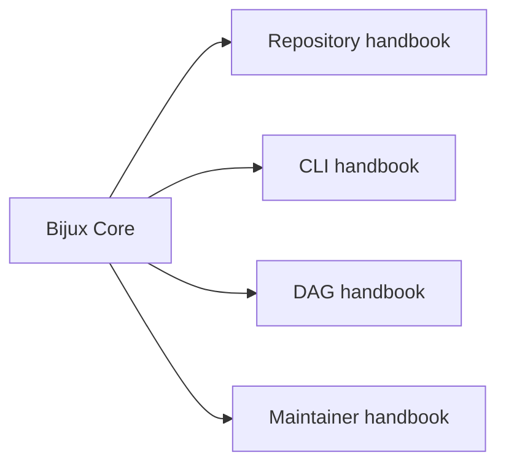

# Bijux Core

<!-- bijux-core-badges:generated:start -->

    

    
<!-- bijux-core-badges:generated:end -->

`bijux-core` publishes two product families from one repository:

- `bijux`, the root command runtime for apps, plugins, config, diagnostics,
  and interactive workflows
- `bijux-dag`, the local-first DAG system for validation, planning, execution,
  replay, artifact inspection, and verification

The same repository also carries the private maintainer surfaces that keep
those products releasable and testable without splitting the proof from the
implementation.

<strong>Start with the surface you care about.</strong>
Repository docs explain shared ownership, publication boundaries, and release
policy. CLI docs own the <code>bijux</code> runtime. DAG docs own
<code>bijux-dag</code>. Maintainer docs own repository gates, diagnostics, and
release proof.

  
<h3>Repository</h3>
Use the repository handbook when the question crosses package boundaries, release policy, or shared ownership rules.

  
<h3>CLI</h3>
Use the CLI handbook for command semantics, runtime behavior, plugin surfaces, REPL behavior, and Python distribution.

  
<h3>DAG</h3>
Use the DAG handbook for graph compilation, execution, replay, artifacts, and DAG command workflows.

  
<h3>Maintainer</h3>
Use the maintainer handbook for repository diagnostics, evidence collection, release verification, and policy enforcement.

<a class="md-button md-button--primary" href="bijux-core/">Open the repository handbook</a>
<a class="md-button" href="bijux-cli/">Open the CLI handbook</a>
<a class="md-button" href="bijux-dag/">Open the DAG handbook</a>
<a class="md-button" href="bijux-dev/">Open the maintainer handbook</a>

## What Is Public Today

| Surface | Public contract |
| --- | --- |
| `bijux` | the visible `bijux --help` command surface and its Rust and Python distribution paths |
| `bijux-dag` | the visible `bijux-dag --help` surface for local DAG validation, planning, execution, replay, inspection, cache work, and verification |
| maintainer tooling | repository-internal only; documented here for contributors, not shipped as end-user product API |

The DAG handbook also calls out what remains experimental, simulated, or
maintainer-only so local product claims do not drift into platform promises.
When the question is what comes after the current `v0.4.0` local boundary, use
the [Bijux Dag Roadmap](tracking/bijux-dag-roadmap.md).

## Handbook Map

## Start Here

- open [Repository Handbook](bijux-core/index.md) for cross-package
  architecture, release policy, publication boundaries, and shared workflows
- open [CLI Handbook](bijux-cli/index.md) for the `bijux` runtime, official
  app mounting, plugin routing, layered config, and the Python bridge
- open [DAG Handbook](bijux-dag/index.md) for local DAG execution, replay,
  evidence, compatibility, and the supported `bijux-dag` surface
- open [v0.4.0 DAG Release Notes](bijux-dag/operations/v0-4-0-release-notes.md)
  when the question is the current public DAG claim, migration path, examples,
  or validation commands
- open [Bijux Dag Roadmap](tracking/bijux-dag-roadmap.md) when the question is
  which DAG capability lane may come next after the current release boundary
- open [Maintainer Handbook](bijux-dev/index.md) for repository gates, docs
  checks, release verification, diagnostics, and governance operations

## Package Flow

| Handbook | Package destinations | Use it when |
| --- | --- | --- |
| [Repository Handbook](bijux-core/index.md) | [Repository Packages](bijux-core/packages/index.md) | the question is about workspace scope, release policy, or cross-package ownership |
| [CLI Handbook](bijux-cli/index.md) | [`bijux-cli`](bijux-cli/packages/bijux-cli.md), [`bijux-cli-python`](bijux-cli/packages/bijux-cli-python.md) | the issue is command behavior, runtime routing, REPL semantics, or Python distribution |
| [DAG Handbook](bijux-dag/index.md) | [`bijux-dag-core`](bijux-dag/packages/bijux-dag-core.md), [`bijux-dag-runtime`](bijux-dag/packages/bijux-dag-runtime.md), [`bijux-dag-app`](bijux-dag/packages/bijux-dag-app.md), [`bijux-dag-cli`](bijux-dag/packages/bijux-dag-cli.md), [`bijux-dag-artifacts`](bijux-dag/packages/bijux-dag-artifacts.md), [`bijux-dag-testkit`](bijux-dag/packages/bijux-dag-testkit.md) | the issue is graph, execution, replay, artifacts, or DAG command behavior |
| [Maintainer Handbook](bijux-dev/index.md) | [`bijux-dev`](bijux-dev/packages/bijux-dev.md) | the issue is repository diagnostics, release proof, or control-plane automation |

## What Ships Today

| Surface | Public delivery | Summary |
| --- | --- | --- |
| `bijux` | Rust crate, PyPI distribution, release bundles | command runtime for config, history, memory, plugins, mounted apps, REPL, and diagnostics |
| `bijux-dag` | Rust crates and release bundles | deterministic DAG validation, execution, replay, artifact inspection, and evidence-backed comparison |
| `bijux-dev` | repository-internal only | maintainer diagnostics, contracts, evidence, and release workflows |

## Reading Rule

Start with the handbook that owns the user-visible behavior. Move to package
pages only when you need the exact implementation boundary or publication
status.
