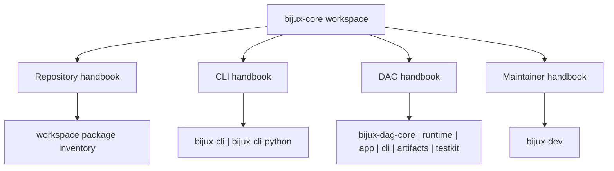

# Bijux Core

`bijux-core` is a deliberately split Rust workspace for command runtime,
deterministic DAG execution, and maintainer governance. The split is part of
the product design: reader-facing behavior, execution truth, and repository
control-plane work live in different places on purpose.

Use this landing page to decide which handbook and which package own the
question before you start reading source files.

<strong>Start with ownership, not just the crate list.</strong>
Repository docs explain cross-workspace policy. CLI docs own the <code>bijux</code>
command product and Python bridge. DAG docs own graph truth, runtime policy,
artifacts, and DAG command orchestration. Maintainer docs own release proof,
repository gates, and governance tooling.

  
<h3>Repository</h3>
Use the repository handbook when the question crosses package boundaries, release policy, or shared ownership rules.

  
<h3>CLI</h3>
Use the CLI handbook for command semantics, runtime behavior, plugin surfaces, REPL behavior, and Python distribution.

  
<h3>DAG</h3>
Use the DAG handbook for graph compilation, execution, replay, artifacts, and DAG command workflows.

  
<h3>Maintainer</h3>
Use the maintainer handbook for repository diagnostics, evidence collection, release verification, and policy enforcement.

<a class="md-button md-button--primary" href="bijux-core/">Open the repository handbook</a>
<a class="md-button" href="bijux-cli/">Open the CLI handbook</a>
<a class="md-button" href="bijux-dag/">Open the DAG handbook</a>
<a class="md-button" href="bijux-dev/">Open the maintainer handbook</a>

## Visual Summary

## Start Here

- open [Repository Handbook](bijux-core/index.md) when the issue spans CLI,
  DAG, and maintainer ownership or touches release policy
- open [CLI Handbook](bijux-cli/index.md) for the `bijux` command product and
  its Python bridge
- open [DAG Handbook](bijux-dag/index.md) for graph truth, runtime policy,
  artifacts, replay, and DAG command behavior
- open [Maintainer Handbook](bijux-dev/index.md) for repository gates,
  diagnostics, docs verification, and release proof

## Package Flow

| Handbook | Package destinations | Use it when |
| --- | --- | --- |
| [Repository Handbook](bijux-core/index.md) | [Repository Packages](bijux-core/packages/index.md) | the question is about workspace scope, release policy, or cross-package ownership |
| [CLI Handbook](bijux-cli/index.md) | [`bijux-cli`](bijux-cli/packages/bijux-cli/index.md), [`bijux-cli-python`](bijux-cli/packages/bijux-cli-python/index.md) | the issue is command behavior, runtime routing, REPL semantics, or Python distribution |
| [DAG Handbook](bijux-dag/index.md) | [`bijux-dag-core`](bijux-dag/packages/bijux-dag-core/index.md), [`bijux-dag-runtime`](bijux-dag/packages/bijux-dag-runtime/index.md), [`bijux-dag-app`](bijux-dag/packages/bijux-dag-app/index.md), [`bijux-dag-cli`](bijux-dag/packages/bijux-dag-cli/index.md), [`bijux-dag-artifacts`](bijux-dag/packages/bijux-dag-artifacts/index.md), [`bijux-dag-testkit`](bijux-dag/packages/bijux-dag-testkit/index.md) | the issue is graph, execution, replay, artifacts, or DAG command behavior |
| [Maintainer Handbook](bijux-dev/index.md) | [`bijux-dev`](bijux-dev/packages/bijux-dev/index.md) | the issue is repository diagnostics, release proof, or control-plane automation |

## Navigation Rule

Start from the handbook that owns the question, then use its package tabs when
you need the exact implementation boundary. If two handbook branches seem to
own the same behavior, treat that as a docs bug and verify the answer from the
[Repository Handbook](bijux-core/index.md).
