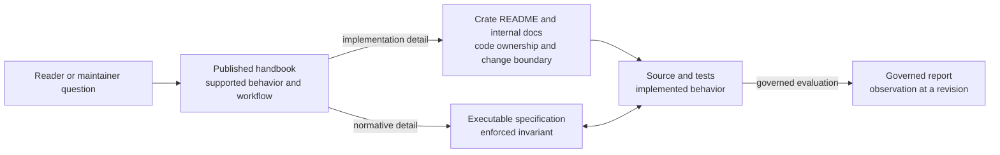

# Bijux Core

<!-- bijux-core-badges:generated:start -->

<!-- bijux-core-badges:generated:end -->

`bijux-core` is one repository with two public products:

- `bijux`, the command runtime for mounted apps, plugins, layered config,
  diagnostics, history, memory, and REPL workflows
- `bijux-dag`, the local-first DAG toolchain for validated graphs, repeatable
  execution, retained evidence, replay, comparison, and verification

The same repository also carries the private maintainer surfaces that release,
audit, and prove those products. Most readers should start with a product
handbook, not the repository or maintainer handbooks.

<strong>Start with the thing you want to run.</strong>
Use the CLI handbook for <code>bijux</code>. Use the DAG handbook for
<code>bijux-dag</code>. Use the repository handbook only when the question
crosses products, packages, or release rules.

  
<h3>Repository</h3>
Use the repository handbook when the question crosses package boundaries, release policy, or shared ownership rules.

  
<h3>CLI</h3>
Use the CLI handbook for command semantics, runtime behavior, plugin surfaces, REPL behavior, and Python distribution.

  
<h3>DAG</h3>
Use the DAG handbook for graph compilation, execution, replay, artifacts, and DAG command workflows.

  
<h3>Maintainer</h3>
Use the maintainer handbook for repository diagnostics, evidence collection, release verification, and policy enforcement.

<a class="md-button md-button--primary" href="bijux-core/">Open the repository handbook</a>
<a class="md-button" href="bijux-cli/">Open the CLI handbook</a>
<a class="md-button" href="bijux-dag/">Open the DAG handbook</a>
<a class="md-button" href="bijux-dev/">Open the maintainer handbook</a>

## What Ships Today

| Surface | Delivery | What you can rely on today |
| --- | --- | --- |
| `bijux` | Rust crate, PyPI distribution, release bundles | the visible `bijux --help` runtime, including apps, plugins, layered config, REPL, diagnostics, history, and memory |
| `bijux-dag` | Rust crates and release bundles | the visible `bijux-dag --help` local DAG surface for validate, plan, run, replay, inspect, compare, cache, and verify workflows |
| maintainer tooling | repository-internal only | contributor and release workflows, not end-user product API |

`bijux-dag` is intentionally honest about its current boundary. The stable lane
is local-first. Experimental, simulated, and maintainer-only routes exist in
the repository, but they are not presented here as the default product story.

## Start In The Right Place

| If you want to... | Open this handbook |
| --- | --- |
| run `bijux`, mount apps, work with plugins, or debug runtime behavior | [CLI Handbook](bijux-cli/index.md) |
| author DAGs, run them locally, inspect artifacts, or replay a run | [DAG Handbook](bijux-dag/index.md) |
| understand what the repository publishes, how crates divide work, or how release boundaries are enforced | [Repository Handbook](bijux-core/index.md) |
| work on repository gates, release proof, or documentation and automation pipelines | [Maintainer Handbook](bijux-dev/index.md) |

## Practical Starting Points

- Read [Executable Examples](bijux-dag/interfaces/runnable-examples.md) when you
  want real DAG workflows with expected outputs, not just feature descriptions.
- Read [First-Run Tutorial](bijux-dag/operations/first-run-tutorial.md)
  when you want the shortest route from checkout to a real retained DAG run.
- Read [CLI Runtime Package](bijux-cli/packages/bijux-cli.md) when you already
  know the question belongs to `bijux` and need the crate boundary.
- Read [DAG Release Notes](bijux-dag/operations/v0-4-0-release-notes.md) when
  you want the current release claim in one place.

## How To Read This Site

- Start with a handbook, not a package page.
- Move to package pages when you need the exact crate boundary or Rust import
  lane.
- Move to repository pages when the question crosses more than one product.
- Move to maintainer pages only when you are changing or validating the
  repository itself.

## Documentation Authority

The website contains curated reader guidance. Executable specifications and
generated evidence remain versioned in the repository but are not presented as
product handbook pages. Read the
[documentation system](bijux-core/foundation/documentation-system.md) for the
authority and maintenance rules.

Arrows do not make every document equally authoritative. Handbooks explain the
supported product, crate pages locate implementation ownership, specifications
state enforced behavior, and reports retain observations. A report cannot
override a contract, and an internal package detail cannot widen the public
product promise.

The [v0.4.0 Release Notes](bijux-dag/operations/v0-4-0-release-notes.md) define
the current DAG release. [Future Direction](bijux-dag/foundation/future-direction.md)
is non-binding direction; if it conflicts with the release boundary, the
narrower shipped claim wins.
