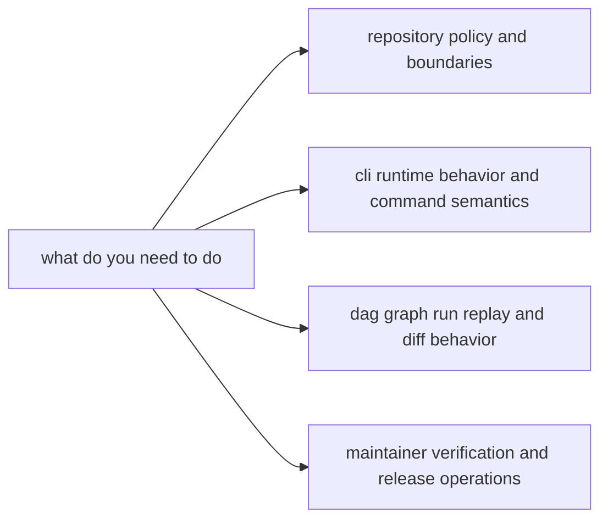

# bijux-core

`bijux-core` is split on purpose. Repository governance, CLI behavior, DAG
runtime behavior, and maintainer automation are separate handbooks so each
surface stays reviewable and stable.

This landing page is for fast routing by task, not by crate name memory.

## Visual Summary

## Handbooks

- [Repository Handbook](bijux-core/index.md)
- [CLI Handbook](bijux-cli/index.md)
- [DAG Handbook](bijux-dag/index.md)
- [Maintainer Handbook](bijux-dev/index.md)

## Start Here

- Use [Repository Handbook](bijux-core/index.md) when the question crosses
  CLI/DAG boundaries or touches shared contracts.
- Use [CLI Handbook](bijux-cli/index.md) for operator-facing command behavior.
- Use [DAG Handbook](bijux-dag/index.md) for graph, run, replay, and artifact
  semantics.
- Use [Maintainer Handbook](bijux-dev/index.md) for maintainer-only automation
  and release workflow operations.

## Task Routing Matrix

| If you need to... | Start here | Why |
|---|---|---|
| understand repository-wide ownership and release policy | [Repository Handbook](bijux-core/index.md) | it owns cross-program contracts and governance |
| troubleshoot or change CLI command behavior | [CLI Handbook](bijux-cli/index.md) | it owns CLI interfaces, operations, and quality contracts |
| troubleshoot DAG validate/run/replay/diff behavior | [DAG Handbook](bijux-dag/index.md) | it owns DAG architecture, interfaces, and operations policy |
| run maintainership gates or release workflows | [Maintainer Handbook](bijux-dev/index.md) | it owns maintainer command surfaces and governance controls |

## Navigation Rule

When a question affects more than one handbook, start from
[Repository Handbook](bijux-core/index.md) and then follow its cross-links to
program-specific pages.
