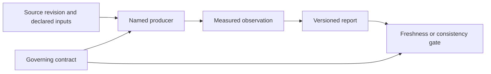

# Governed Report Evidence

`docs/reports/` retains reviewable evidence generated or mechanically checked
by repository tooling. Reports record what a named check observed at a
particular source state. They do not define product behavior and are excluded
from the public MkDocs site.

This directory exists because some architecture, coverage, compatibility, and
governance decisions require a versioned comparison across commits. Console
logs and one-off local analysis do not meet that need and belong under
`artifacts/` instead.

## Report Classes

| Directory | Purpose | Typical producer |
| --- | --- | --- |
| `foundation/` | architecture inventories, package boundaries, coverage gaps, hardening evidence, and release-readiness observations | `bijux-dev` commands and report generator binaries |
| `governance/` | drift, invariants, security debt, non-hermetic behavior, concurrency findings, and documentation authority | governance commands and manually reviewed ledgers |

Generated and curated reports coexist, but their update rules differ. Generated
files must be reproduced by their owning command. Curated ledgers must identify
the check or evidence supporting each status claim.

## Evidence Chain

A report is trustworthy only when the chain can be reconstructed. The source
revision may be implicit when the report is generated and committed in the
same revision, but external inputs, comparison baselines, and non-default
configuration must be named.

## Evidence Is Not Authority

The relationship between specifications and reports is directional:

1. code and schemas implement a behavior;
2. `docs/spec/` states the enforced contract;
3. tests and maintainer commands evaluate the implementation;
4. `docs/reports/` retains the resulting evidence.

When a report conflicts with its contract or current generated output, the
report is stale. Do not change a specification merely to make stale evidence
look current, and do not present a passing report as proof of behavior outside
the scope stated by its producer.

## Updating A Report

Before committing a report change:

- find the producer by searching for the exact repository-relative path;
- run that producer from the repository root with outputs directed to their
  governed locations;
- inspect the semantic difference, not only whether the file changed;
- run the contract test or CI lane that checks the report;
- commit generator changes separately from generated output when they express
  independently reviewable intent;
- record unresolved failures in the owning governance ledger rather than
  deleting rows or weakening thresholds.

Reports without an identifiable producer must state their owner, evidence
source, and review condition in the document. A snapshot with no reproducible
origin should be moved to `artifacts/` or removed.

## Freshness And Failure

A report is stale when its governed inputs changed without regeneration, its
producer no longer emits the checked shape, or its retained claim no longer
matches the enforcing test. Staleness is a failing repository condition, not a
documentation warning.

When regeneration fails:

1. preserve the producer's non-zero status and diagnostics under `artifacts/`;
2. leave the last valid report unchanged rather than writing a partial result;
3. fix the implementation, producer, or declared contract according to the
   intended behavior;
4. regenerate and review the complete semantic diff;
5. commit the report only after its freshness gate passes.

Generated reports should be written atomically when practical so interruption
cannot replace valid evidence with a truncated file. Curated ledgers must not
delete unresolved rows merely to satisfy a count or status assertion.

## Naming And Retention

Internal specifications and retained reports use descriptive uppercase
snake-case filenames, such as `RUNTIME_MODULE_OWNERSHIP_REPORT.md`. `README.md`
is the only conventional mixed-case filename in these roots. Public handbook
pages use lowercase kebab-case because their paths are published URLs.
Producers, consumers, and contract tests must change in the same commit as any
governed report rename.

Names state the measured surface or governed decision. They do not encode
delivery order, review sequence, or broad claims such as `FINAL_REPORT.md`.

Retain a report in Git only when review depends on comparing it across commits
or a repository contract requires it. High-volume logs, build products, local
benchmarks, and transient diagnostic output belong under `artifacts/`.

## Review Checklist

A reviewer should be able to answer:

- Which command or process produced this evidence?
- Which contract defines the expected result?
- What source revision or inputs does the observation describe?
- Is a changed count an improvement, a regression, or an expected consequence?
- Which test detects stale output?
- Does the report make any claim broader than the collected evidence?

If those questions cannot be answered, the report is not trustworthy enough to
support a release or architecture decision.
