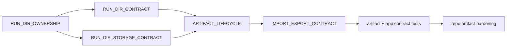

# Artifact Contract Report

## Assessment Boundary

This report defines the evidence required to claim that run-directory and
portable-bundle contracts are governed. It does not assert that every run in a
local artifact root is valid. Validation remains per run or per bundle.

## Contract Chain

## Authorities

| Concern | Authority | Executable backing |
| --- | --- | --- |
| package and mutation ownership | `docs/spec/RUN_DIR_OWNERSHIP.md` | dependency and hardening contracts |
| authoritative, optional, and derived paths | `docs/spec/RUN_DIR_CONTRACT.md` | run-directory golden and import/export tests |
| durable writes, markers, and strict finalization | `docs/spec/RUN_DIR_STORAGE_CONTRACT.md` | `artifact_hardening_contracts.rs` |
| lifecycle and accepted transitions | `docs/spec/ARTIFACT_LIFECYCLE.md` | storage and retention contract suites |
| bundle version, profiles, and provenance | `docs/spec/IMPORT_EXPORT_CONTRACT.md` | application import/export and corruption suites |
| cross-surface foundation posture | `repo.artifact-hardening` | `run_dir_import_export_hardening_contracts.rs` |

## Acceptance Criteria

Artifact governance is acceptable when:

- staging and final identities are exclusive and path-safe;
- required evidence is distinguished from optional and derived output;
- governed records use durable replacement and failures remain actionable;
- complete and incomplete finalization produce unambiguous markers;
- standard and strict verification differ only by documented requirements;
- digest, lineage, schema, and path failures are refusals rather than warnings;
- export profiles state whether payload-backed replay is possible;
- import validates version, integrity, identity, and rooted paths before
  materialization;
- corruption fixtures cover refusal behavior without rewriting expectations;
- retained evidence can be traced to owning code, contract, and focused test.

## Non-Claims

This report does not prove backend durability beyond declared capabilities,
that a complete run is semantically correct, that a manifest-only bundle can be
replayed, or that imported evidence is safe to execute. Those claims require
backend, graph, runtime, and replay evidence respectively.

## Review Procedure

1. run the focused artifact and import/export contract suites;
2. inspect changed schemas, fixtures, and golden evidence semantically;
3. verify standard and strict command outcomes on complete, incomplete, and
   corrupt fixtures;
4. run `repo.artifact-hardening` through the maintainer command surface;
5. record source commit, commands, status, and any scoped exception.

Missing evidence is incomplete review. A changed expected fixture is not
automatically proof that the implementation is correct.
