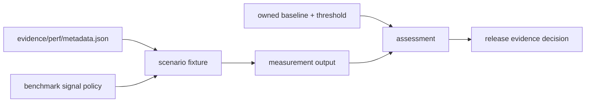

# Performance Evidence Report

## Authority

This report defines how foundation review interprets performance evidence. It
is an index and acceptance contract, not a benchmark result. Current
measurements remain valid only for the source revision, scenario, environment,
and threshold recorded with them.

## Evidence Flow

The registry states which scenarios are release-relevant. The benchmark-signal
policy states which claim family each benchmark can support. Measurement output
provides observations. Baselines and thresholds provide the comparison rule.
None of these inputs can substitute for another.

## Authorities

| Concern | Authority |
| --- | --- |
| scenario inventory, class, owner, and threshold reference | `evidence/perf/metadata.json` |
| evidence format and required provenance | `evidence/perf/CONTRACT.md` |
| supported claim and noise class | `configs/dag/policy/benchmark_signal_governance.json` |
| regression thresholds | `evidence/perf/baselines/regression_thresholds.json` and scenario references |
| governance validation | `bijux-dev-dag performance-evidence-report` |
| command implementation | `crates/bijux-dev/src/commands/perf_evidence.rs` |

## Release Acceptance

A release-relevant scenario is acceptable only when:

- its fixture and measurement method match the registry;
- its source commit and execution environment are identifiable;
- correctness, artifact integrity, and replay semantics pass before timing is
  interpreted;
- the referenced baseline and threshold are present and owned;
- observed regression remains within the threshold, or a reviewed exception
  records scope, evidence, owner, and expiry;
- the report distinguishes a measured pass from missing or stale evidence.

An advisory or experimental scenario cannot block release unless the registry
promotes it with an owned threshold. Conversely, removing a failing scenario
from the release-relevant set is a governance change, not a performance fix.

## Failure Interpretation

| Condition | Classification |
| --- | --- |
| correctness or evidence shape changed | behavioral failure; timing is not accepted |
| required measurement is absent | incomplete evidence |
| baseline or threshold cannot be resolved | governance failure |
| threshold is exceeded in a controlled environment | performance regression |
| environment differs materially | non-comparable observation until rerun or bounded analysis |
| only advisory evidence regresses | investigation required; no automatic release claim |

## Review Record

Foundation review should retain the exact command, source commit, scenario set,
measurement artifact paths, environment identity, and final classifications.
This page must not be edited to embed a favorable number; governed outputs and
their provenance carry the observation.
