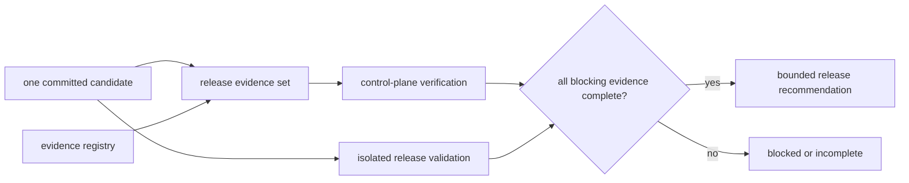

# Release Evidence Report

## Decision Boundary

This page is the canonical human release-evidence summary named by
`configs/dag/policy/evidence_rationalization_policy.json`. It defines how to
assemble a decision; it does not contain live release status and must not be
read as a pass for the current commit.

## Evidence Chain

Every input to the decision must identify the same source candidate or explain
why it is external, versioned evidence with a compatible scope.

## Authorities

| Concern | Authority |
| --- | --- |
| blocking and advisory evidence membership | `evidence/release/release_evidence_set.json` |
| evidence identity, kind, ownership, and release-blocking flag | `evidence/_meta/registries/evidence_registry.json` |
| required and advisory families | `configs/dag/policy/release_evidence_policy.json` |
| evidence-set validation | `crates/bijux-dev/src/commands/evidence_control_plane.rs` |
| installable Rust candidate validation | `make release-validate-rs` and the release validation handbook |
| binary first-run scenarios | `docs/spec/RELEASE_BINARY_VERIFICATION.md` |
| package publication boundary and order | `contracts/foundation/workspace_package_boundary.v1.json` |
| proof interpretation | `docs/reports/foundation/REPOSITORY_PROOF_STATEMENT.md` |

## Blocking And Advisory Evidence

Blocking evidence must cover the required families declared by policy and pass
registry consistency checks. Advisory evidence remains visible but cannot turn
a blocking failure into a pass. Removing a failing asset from the release set,
changing its release-blocking flag, or lowering a minimum set is a governance
change that requires independent review.

## Candidate Acceptance

A release recommendation requires:

- an immutable full source commit with a clean prepared release tree;
- successful evidence-set and registry validation;
- terminal success for every required release-validation command;
- package, binary, schema, artifact, cache, replay, configuration, and
  compatibility evidence required by the candidate's changed surfaces;
- release notes and public docs that match the tested boundary;
- explicit platform, Python, backend, performance, soak, and live-environment
  omissions;
- no unresolved blocking asset or hidden failed, skipped, or unavailable lane.

The `check_release_evidence_ready` inventory in `bijux-dev` confirms required
surfaces exist. It does not establish their semantic correctness or terminal
status.

## Decision States

| State | Meaning |
| --- | --- |
| prepared | candidate and expected evidence inputs are identified |
| running | one or more required commands have started; no pass claim is valid |
| blocked | required behavior, evidence, compatibility, or release command failed |
| incomplete | required evidence, provenance, environment, or final status is absent |
| recommend | all blocking requirements pass for the declared scope and revision |
| superseded | a newer candidate exists; prior evidence remains historical |

## Non-Claims

A recommendation does not prove untested platforms, unavailable backends,
uncommitted work, Python distribution health unless separately run, universal
performance, absence of security defects, or behavior of a later commit.
Advisory evidence can strengthen context but cannot broaden these claims.

## Review Record

Retain the full commit, exact commands, terminal statuses, release-validation
artifact directory, evidence-set revision, failed or omitted lanes, and final
decision. A dashboard, report path, or PID without those facts is incomplete
evidence.
