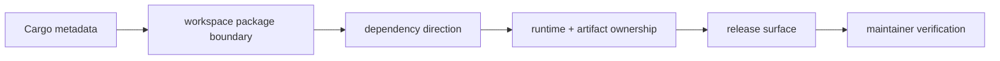

# Repository Architecture Report

## Assessment Boundary

This report records the architecture claims that foundation review must prove.
It is not a source-tree tour and does not declare the repository healthy merely
because required files exist.

## Architecture Chain

## Authorities

| Claim | Authority | Verification |
| --- | --- | --- |
| workspace membership and dependency graph | `Cargo.toml` and package manifests | Cargo metadata and dependency contract tests |
| public versus private package status | `contracts/foundation/workspace_package_boundary.v1.json` | release-boundary contracts |
| product and support topology | `docs/bijux-core/architecture/workspace-topology.md` | documentation source-reference and architecture tests |
| allowed dependency direction | `docs/bijux-core/architecture/dependency-direction.md` | crate boundary and forbidden-dependency suites |
| DAG release lanes | `contracts/foundation/dag_release_truth_table.v1.json` | command inventory and release-boundary contracts |
| maintainer command surface | `contracts/foundation/maintainer_command_surface.v1.json` | `bijux-dev` command-surface tests |
| run evidence ownership | `docs/spec/RUN_DIR_OWNERSHIP.md` | artifact hardening and import/export contracts |

## Required Architecture Properties

- The `bijux` and `bijux-dag` product families remain independently installable
  and do not imply one another's runtime.
- Public crates do not depend on private testkit or maintainer packages.
- Graph semantics point toward the kernel; execution and presentation do not
  redefine graph identity.
- Artifact layout and integrity remain owned below application presentation.
- Executable entrypoint crates stay thin; product behavior remains in the
  owning library or application package.
- Repository checks and evidence collection stay outside production runtime
  dependency paths.
- Machine-readable release and package contracts agree with manifests, docs,
  workflows, and generated references.

## Review Evidence

Foundation review must inspect dependency contracts, publication matrices,
command inventories, artifact ownership checks, and documentation references.
The minimum review record includes source commit, exact commands, final status,
and scoped omissions. A file-existence guard is only an inventory check and
must not be reported as semantic architecture validation.

## Failure Conditions

Architecture review fails when a private package becomes a public dependency,
an executable wrapper acquires product policy, release automation omits a
public package, two documents claim ownership of the same serialized fact, or a
machine contract contradicts the shipped command surface.

## Non-Claims

This report does not prove runtime correctness, backend availability,
performance, package publication, or release readiness. Those require their
own focused evidence and final statuses.
