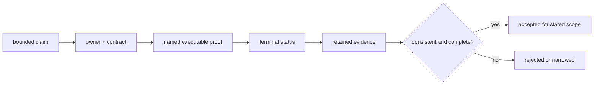

# Repository Proof Statement

## Proof Standard

Repository proof is a traceable chain from one bounded claim to authority,
executable observation, terminal status, and revision-bound evidence. No
individual layer proves the repository as a whole.

## Evidence Roles

| Layer | Establishes | Cannot establish alone |
| --- | --- | --- |
| source implementation | behavior that can be executed | support status or correctness |
| machine contract or executable specification | required meaning and compatibility | that implementation conforms |
| focused test | one observed behavior under its setup | universal behavior or release readiness |
| aggregate gate | selected suite status | omitted lanes or unavailable platforms |
| generated report | producer observation for one revision | a new product promise |
| public handbook | reader-facing supported boundary | implementation truth without backing |
| package or binary verification | installable artifact behavior | unrelated source, Python, backend, or performance claims |

## Acceptance Conditions

A claim is accepted only when:

- one package or governance surface owns it;
- the authority states current scope and refusal behavior;
- an executable proof reaches the claimed semantics;
- the command completed with a terminal status;
- source revision, selection, features, platform, and exclusions are known;
- retained evidence agrees with the authority and result;
- public wording is no broader than the evidence.

Missing evidence narrows the claim. It does not inherit confidence from another
crate, an earlier commit, a simulated backend, or a green unrelated suite.

## Proof States

| State | Meaning |
| --- | --- |
| specified | authority exists; execution has not established conformity |
| running | proof command started; no pass claim is valid |
| failed | behavior or proof infrastructure failed with recorded status |
| passed | required command completed successfully for the stated scope |
| incomplete | required status, provenance, selection, or evidence is absent |
| superseded | result remains historical evidence for an older source revision |

## Invalid Proof Patterns

- treating file existence as semantic validation;
- editing expected evidence to match an unexplained implementation change;
- reporting a background PID or log path as a pass;
- omitting failed, skipped, ignored, slow, leaky, unavailable, and advisory
  outcomes;
- using coverage percentage as a substitute for behavioral assertions;
- presenting an internal, experimental, or simulated route as stable;
- claiming generated provenance when no producer exists.

## Repository Trust Decision

The repository is trustworthy only to the extent that its current claims can
be reconstructed through this chain. This statement does not claim absence of
defects, formal verification, universal platform support, or readiness to
release. Those conclusions require explicit, current evidence and can remain
false while individual proof chains pass.

## Review Record

A decision records the claim, authority, exact command, full source commit,
selection and environment, terminal outcome, retained location, and known
limitations. Existing logs, reports, manifests, and review text may provide the
record when they identify the same revision and do not contradict one another.
