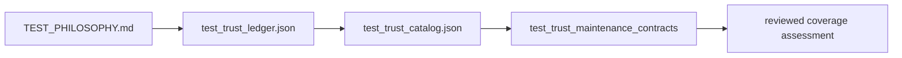

# Test Trust Coverage Report

## Evidence Status

This is a curated, revision-bound assessment. It is not generated: the
repository currently has no command that produces this file. Its conclusions
must be reviewed against the machine-readable ledger, runtime catalog, focused
maintenance suite, and the actual assertions in named tests.

## Evidence Chain

The maintenance suite proves references, required sections, and catalog
relationships. It does not prove that every listed test reaches the claimed
behavior or makes a strong semantic assertion.

## Authorities

| Concern | Authority |
| --- | --- |
| human proof standard | `TEST_PHILOSOPHY.md` |
| trust classes, critical files, semantic surfaces, and families | `configs/dag/policy/test_trust_ledger.json` |
| runtime test inventory | `crates/bijux-dag-runtime/tests/fixtures/test_trust_catalog.json` |
| executable reference validation | `crates/bijux-dev/tests/test_trust_maintenance_contracts.rs` |
| generated maintenance observation | `docs/reports/foundation/TEST_TRUST_MAINTENANCE_REPORT.md` |

## Coverage Acceptance

A trust family is covered only when:

- every referenced path exists at the reviewed revision;
- at least one named test reaches the owned behavior;
- assertions check semantic outcomes rather than only process start, file
  existence, wording, or duplicated implementation logic;
- critical failure and recovery paths are represented where the claim depends
  on them;
- ignored, filtered, platform-limited, advisory, and simulated results remain
  visible;
- the terminal result belongs to the same source revision as this assessment.

Nonempty families and green reference checks are necessary but insufficient.

## Debt Interpretation

| Classification | Review action |
| --- | --- |
| critical | preserve independent semantic proof and failure visibility |
| useful | keep when it adds behavior or boundary evidence |
| shallow | strengthen assertions or narrow the claim |
| cosmetic | keep only when presentation is itself governed |
| duplicate | consolidate after confirming no independent trust property is lost |
| unclassified | assign an owner and trust property before relying on it |

Counts are inventory facts, not quality scores. Moving a test to a stronger
class without changing its assertions does not improve trust.

## Required Review Record

Record the source commit, ledger and catalog diffs, exact maintenance command,
terminal status, affected test commands, and any unexecuted platform or slow
lane. If those facts are unavailable, classify the assessment as incomplete
rather than carrying forward an older pass.

## Current Limitation

Because this report has no producer, drift detection depends on contract tests
plus human review. If automated generation is introduced, its command, schema,
deterministic output contract, and drift check must land together before this
file is reclassified as generated.
