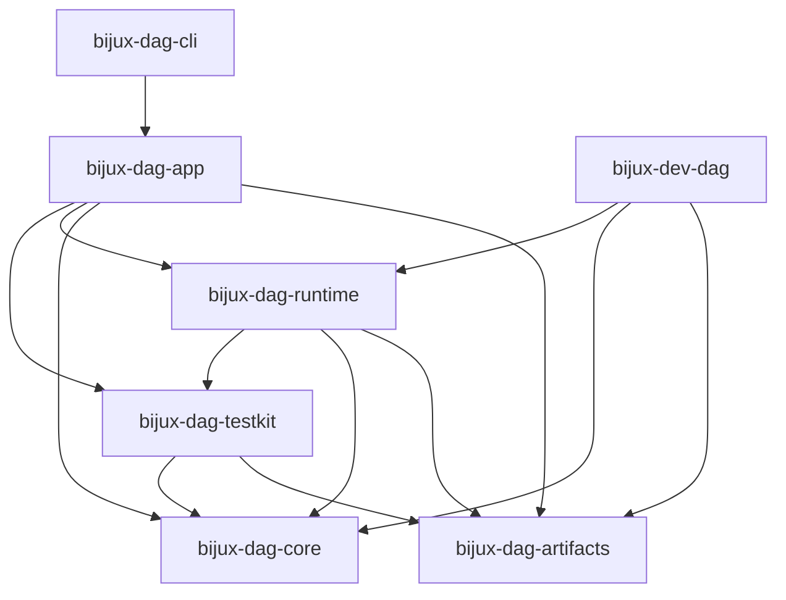

# Crate graph snapshot

Generated from `cargo metadata --format-version 1`.

```mermaid
graph TD
  bijux-dag-app --> bijux-dag-artifacts
  bijux-dag-app --> bijux-dag-core
  bijux-dag-app --> bijux-dag-runtime
  bijux-dag-app --> bijux-dag-testkit
  bijux-dag-cli --> bijux-dag-app
  bijux-dag-runtime --> bijux-dag-artifacts
  bijux-dag-runtime --> bijux-dag-core
  bijux-dag-runtime --> bijux-dag-testkit
  bijux-dag-testkit --> bijux-dag-artifacts
  bijux-dag-testkit --> bijux-dag-core
  bijux-dev-dag --> bijux-dag-artifacts
  bijux-dev-dag --> bijux-dag-core
  bijux-dev-dag --> bijux-dag-runtime
```
