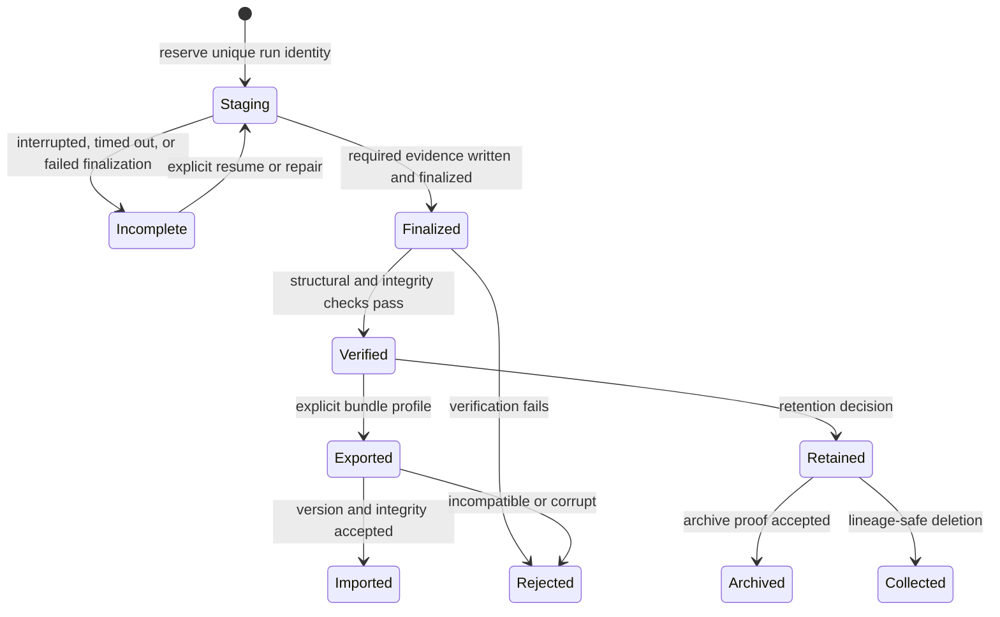

# Artifact Lifecycle

Run evidence moves through explicit states. Files appearing on disk do not
advance the lifecycle by themselves; each transition has an owner, required
records, and a refusal condition.

## State Model

`Imported` means the bundle was accepted into an owned destination. It does not
mean every export profile contains enough evidence for replay.

## Transition Contract

| Transition | Owner | Required evidence | Refusal condition |
| --- | --- | --- | --- |
| create staging | `bijux-dag-artifacts` | valid run ID and absent staging/final paths | invalid ID, path collision, or ambiguous resume state |
| record execution | `bijux-dag-runtime` through artifact services | graph identity, attempts, states, logs, provenance, indexes | unsafe path, write failure, or contract-invalid record |
| mark incomplete | runtime and artifact finalization | explicit `.run-incomplete.json` reason | marker cannot be written durably |
| finalize complete | `bijux-dag-artifacts` | required records, `manifest.finalized.json`, `.run-complete.json` | incomplete state, missing manifest, or final-path collision |
| publish final directory | `RunDir` | finalized staging directory | rename failure or existing final directory |
| verify | artifact verifier, selected by application route | required layout, schema, digests, markers at requested strictness | any required anomaly or integrity mismatch |
| export | application orchestration over artifact services | verified source facts and declared export profile | unsupported profile, unsafe path, missing required payload |
| import | application orchestration over artifact services | supported bundle version, compatible schema, verified bundle integrity | unsupported version, corruption, path escape, or identity conflict |
| retain or collect | artifact lifecycle policy | classification, lineage, inventory, and decision record | unverified inventory or retained descendant dependency |

## Complete, Incomplete, And Corrupt

- **Complete** means finalization recorded the complete mode and published the
  expected completion marker. Strict verification may still reject the run.
- **Incomplete** means execution or finalization did not establish complete
  evidence. Partial outputs can support diagnosis but cannot be treated as
  trusted replay input.
- **Corrupt** means recorded evidence contradicts the bytes, schema, identity,
  lineage, or required layout. Corruption is not repaired by changing the
  expected digest.

These states are not interchangeable. A failed node can exist in a structurally
complete run; an apparently successful node set can exist in a corrupt run.

## Atomicity Boundary

Governed JSON records use a sibling temporary file and rename so readers do not
observe partial record contents. The complete run transaction is broader:
runtime writes into `run.tmp-<id>`, finalization writes manifest and marker
state, and `RunDir::finalize` renames the staging directory to `run-<id>`.
Atomic record replacement does not make a partially populated staging
directory complete.

## Import And Export Profiles

`export-bundle/v0.1` distinguishes structural and payload-bearing profiles.
Manifest-only and artifact-omitting bundles can support compatibility or
provenance inspection without supporting artifact-backed replay. Redaction is
irreversible and must be recorded. Import validates compatibility before
materialization and never rewrites the source bundle.

## Evolution Rule

Adding optional evidence is compatible only when old readers preserve or safely
ignore it and required meaning does not change. Changing a required path,
completion marker, digest rule, export profile, or strict-verification outcome
requires coordinated schema, contract, fixture, test, and compatibility
updates.

## Related Tests

- `crates/bijux-dag-app/tests/run_dir_import_export_contract.rs`
- `crates/bijux-dag-artifacts/tests/artifact_hardening_contracts.rs`
- `crates/bijux-dag-artifacts/tests/run_manifest_roundtrip_and_retention_contracts.rs`
- `crates/bijux-dev/tests/run_dir_import_export_hardening_contracts.rs`
