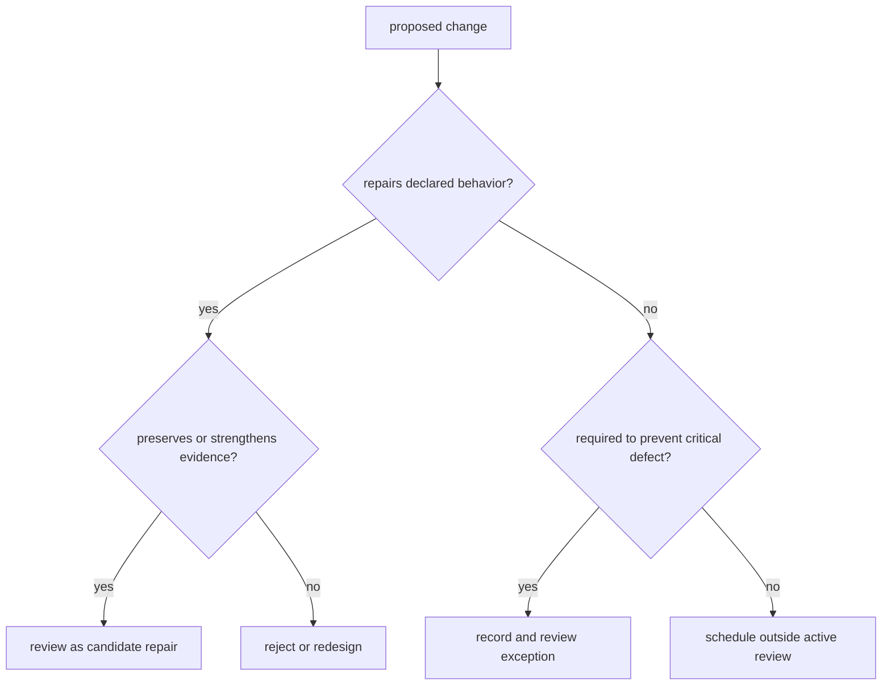

# Feature Development Freeze Policy

Foundation and release review stabilize an already declared candidate. They
are not a route for expanding product scope while evidence is being assembled.
The freeze protects review comparability: every new behavior changes the claim,
proof, compatibility, and release surface under evaluation.

## Activation

The freeze is active when maintainers begin foundation review or prepare a
release candidate from a named commit. The review record must identify the
candidate, declared public and internal surfaces, required gates, and known
limitations.

## Allowed Changes

Changes are allowed when they restore or clarify the declared boundary:

- fix a defect in supported behavior;
- repair a failing contract, test, package, documentation, or release gate;
- remove false, duplicate, stale, or unsupported claims;
- strengthen isolation, integrity, failure handling, or evidence provenance;
- align manifests, schemas, generated references, docs, and release automation;
- add missing proof for behavior already in the candidate contract;
- narrow a surface that cannot meet its stated evidence requirement.

An allowed fix still receives normal compatibility and risk review. “Required
for release” does not exempt it from tests.

## Prohibited Widening

The active review must not add:

- a new public command, API, schema family, package, backend, or execution mode;
- a new compatibility promise or persistence format unrelated to a defect;
- an internal or simulated route promoted only to improve release narrative;
- a new dependency or abstraction without a candidate-blocking ownership need;
- a benchmark, report, or test whose only purpose is to inflate counts;
- a weakened threshold, exclusion, retry, allowlist, or classification intended
  to turn a failure green.

Such work belongs after the current candidate decision with its own authority
and evidence.

## Exception Standard

An exception is valid only when not changing scope would create a correctness,
security, integrity, legal, or release-blocking compatibility defect. Record
the owning package, exact defect, proposed scope, alternatives rejected,
compatibility impact, required proof, reviewer, and candidate identity.
Convenience, schedule pressure, or an attractive adjacent feature is not an
exception.

## Change Classification

## Exit

The freeze ends when the candidate is released, rejected, or explicitly
abandoned. A later commit is a new candidate and requires fresh evidence.
Outstanding deferred work does not silently join the released boundary; it
returns through normal design, compatibility, and proof review.
