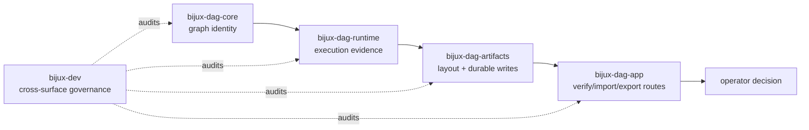

# Run Directory Ownership

A run directory is one evidence envelope with several producers, but it has one
storage authority. Ownership is split so graph meaning, runtime observation,
filesystem safety, and operator presentation cannot silently redefine one
another.

## Ownership Flow

The application layer may request storage operations and render verification
results. It does not own manifest identity, digest semantics, or finalization.
The maintainer package audits the boundaries; it does not become a product
runtime dependency.

## Responsibility Matrix

| Package | Owns | May write | Must not redefine |
| --- | --- | --- | --- |
| `bijux-dag-core` | graph validation, canonical graph identity, node and dependency meaning | graph models before execution | run storage layout or backend observations |
| `bijux-dag-runtime` | attempts, states, scheduler decisions, backend identity, logs, provenance, and runtime-produced indexes | active evidence through artifact APIs in the staging directory | path safety, durable-write guarantees, or operator output schemas |
| `bijux-dag-artifacts` | run paths, staging/final naming, rooted path checks, atomic record writes, manifests, indexes, digests, markers, finalization, and verification primitives | storage-owned records and lifecycle markers | graph semantics or retry policy |
| `bijux-dag-app` | command routing, strictness selection, import/export orchestration, response schemas, and process status | command-requested bundles or repairs through owned services | artifact integrity outcomes or completion state |
| `bijux-dev` | contract alignment, evidence inventory, fixture governance, and release checks | governed reports through explicit producer commands | product data or successful verification |

## Mutation Rights

During execution, runtime code writes only to the staging run through
artifact-owned paths and writers. Finalization creates the final manifest and
completion state, then publishes the directory by rename. After publication:

- inspection and verification are read-only;
- export reads evidence into a new bundle;
- import materializes a distinct owned destination after compatibility checks;
- repair creates or records an explicit repair path rather than rewriting
  historical evidence invisibly;
- retention and collection follow lineage and policy, not ad hoc deletion.

No reader may “fix” a digest, marker, or index in place to make verification
pass. A mismatched record is evidence of corruption or an incompatible
producer.

## Concurrency And Identity

Run identity is exclusive across `run.tmp-<id>` and `run-<id>`. Creation
refuses an existing staging or final path. Resume requires an unambiguous owned
path and preserves prior attempts. Finalization never merges two directories.
Tests must use isolated run roots and unique identifiers; serialization is not
a substitute for resource ownership.

## Verification Responsibility

`bijux-dag-artifacts` reports structural and integrity facts. `bijux-dag-app`
maps those facts to standard or strict operator verification and stable output.
Callers decide whether the verified evidence is sufficient for replay,
comparison, promotion, or release. Directory existence, import success, or a
completion marker alone is not trust.

## Change Rule

A change to an owned field, path, marker, digest, or verification class must
update:

- the owning crate implementation and crate-local contract;
- `RUN_DIR_CONTRACT.md` or `RUN_DIR_STORAGE_CONTRACT.md`;
- import/export compatibility when the portable bundle is affected;
- focused artifact and application contract tests;
- maintainer governance when a release claim changes.

## Related Evidence

- `crates/bijux-dag-artifacts/src/storage/hardening.rs`
- `crates/bijux-dag-app/tests/run_dir_import_export_contract.rs`
- `crates/bijux-dag-artifacts/tests/artifact_hardening_contracts.rs`
- `crates/bijux-dev/tests/run_dir_import_export_hardening_contracts.rs`
