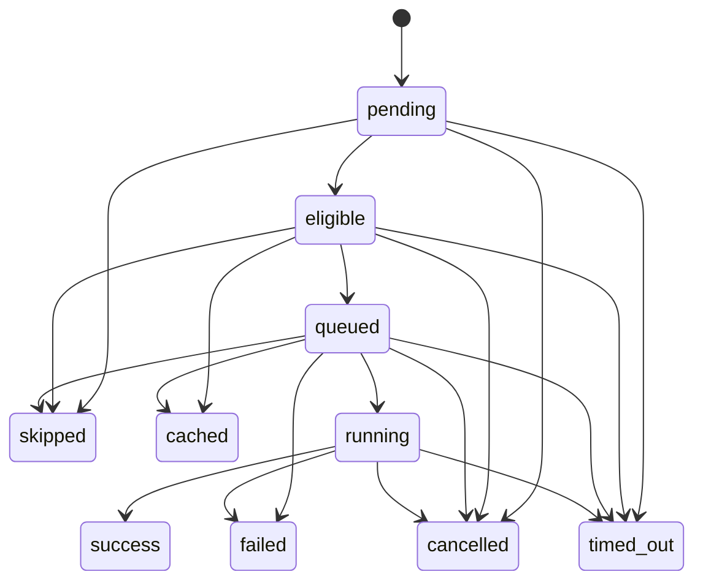
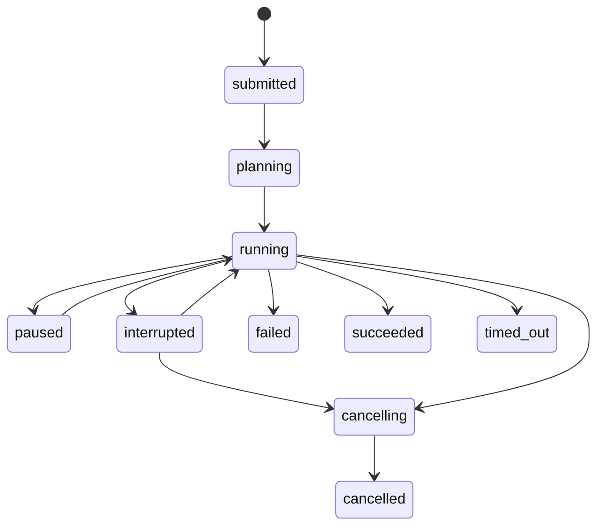

# State Machine Visualization

This visualization mirrors the lifecycle contract in
`docs/spec/STATE_MACHINE_CONTRACT.md`.

## Node lifecycle

## Run lifecycle

## Verification anchors

- `validate_node_transition`
- `validate_run_transition`
- `verify_post_run_state_consistency`
- `terminal_transition_audit_events`
- `run_dag_verify_state`
